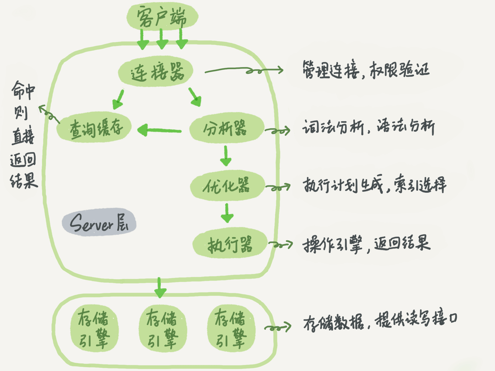
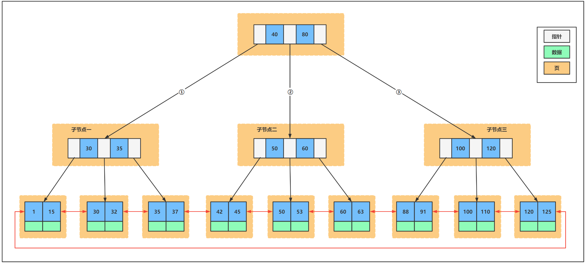
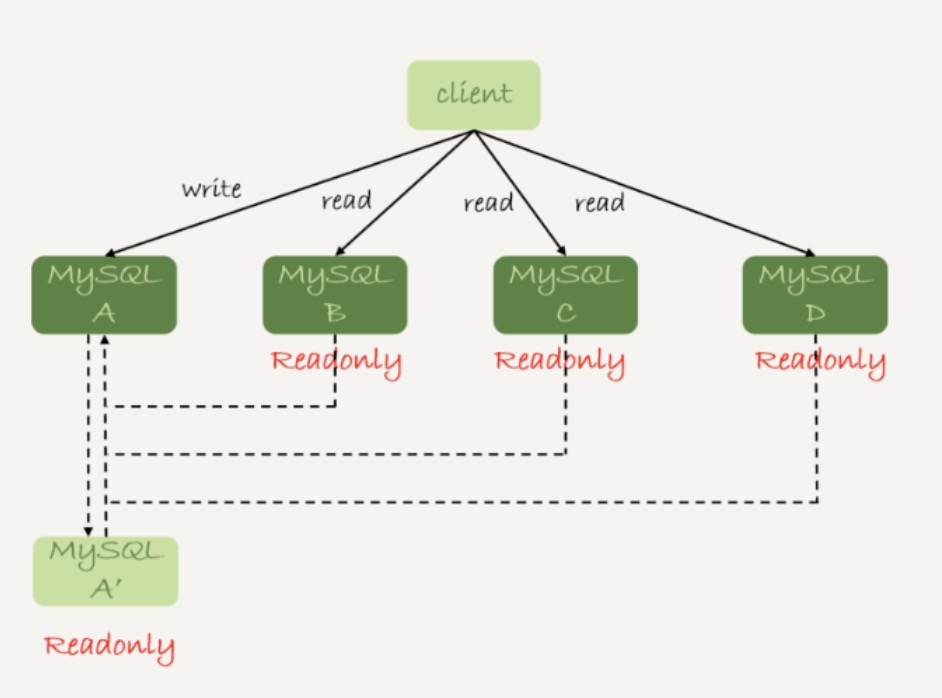
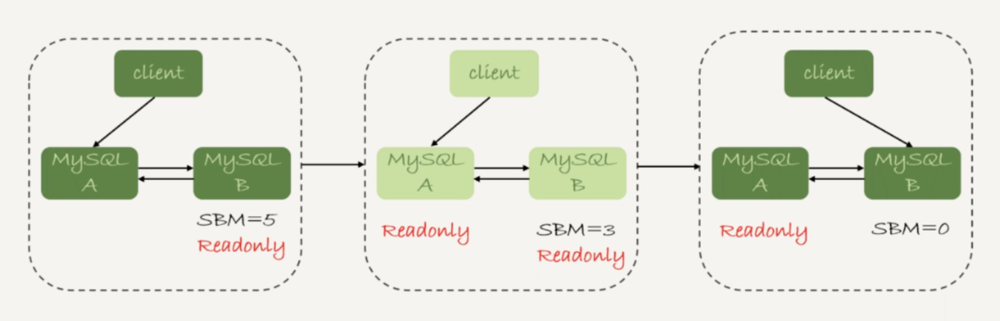

## 逻辑架构



### 客户端

向数据库发送请求（采用数据库连接池，减少频繁的开关连接）

### 服务端

Server 层包括连接器、查询缓存、分析器、优化器、执行器等，涵盖 MySQL 的大多数核心服务功能，以及所有的内置函数（如日期、时间、数学和加密函数等），所有跨存储引擎的功能都在这一层实现，比如存储过程、触发器、视图等。

1. 连接器: 控制用户的连接 权限验证  ```mysql -h 127.0.0.1 -P 3306 -u root```

   - 如果用户名密码认证通过，连接器会到权限表里面查出你拥有的权限。之后，这个连接里面的权限判断逻辑，都将依赖于此时读到的权限。

   - MySQL 在执行过程中临时使用的内存是管理在连接对象里面的。这些资源会在连接断开的时候才释放。（mysql_reset_connection >= 5.7）

     ```mysql
     -- 客户端如果太长时间没动静，连接器就会自动断开连接 28800秒/8小时
     show variables like 'wait_timeout';
     ```

     

2. 分析器: 词法分析/语法分析（AST 抽象语法树）

3. 优化器: 优化SQL语句，规定执行流程（可以查看SQL语句的执行计划，可以采用对应的优化点，来加快查询）

   * RBO 基于规则优化
   * CBO 基于成本优化

4. 执行器: SQL语句的实际执行组件（判断一下对表  有没有执行查询的权限）

存储引擎：不同的存放位置，不同的文件格式

1. InnoDB: 内存
2. MyISAM: 磁盘
3. Memory: 内存
4. Innodb：frm是表定义文件，ibd是数据文件
5. Myisam：frm是表定义文件，myd是数据文件，myi是索引文件

## 日志

### InnoDB

#### 重做日志 redo log

一组 4 个文件，每个文件的大小是 1GB。如果redo log 设置太小，很快就会被写满，write pos 一直追着 CP。看到的现象就是**磁盘压力很小，但是数据库出现间歇性的性能下跌。**

- 保证事务的原子性和持久性
- 物理日志 页的物理修改操作
- 循环写 空间固定会用完
- 保证即使数据库发生异常重启，之前提交的记录都不会丢失，称为**crash-safe**。

#### 回滚日志 undo log

- 保证事务一致性 
- 逻辑日志 回滚到行记录到某个特定版本 根据每行进行记录

### Server层

#### 归档日志 binlog

因为最开始 MySQL 里并没有 InnoDB 引擎。MySQL 自带的引擎是 MyISAM，但是 MyISAM 没有 crash-safe 的能力，binlog 日志只能用于归档。只依靠 binlog 是没有 crash-safe 能力的。

- 逻辑日志 sql语句 两阶段提交保证数据库使用binlog日志恢复的时候和当时的数据库状态一致。简单说，redo log 和 binlog 都可以用于表示事务的提交状态，而两阶段提交就是让这两个状态保持逻辑上的一致。
- 追加写入 文件写到一定大小后会切换到下一个，并不会覆盖以前的日志。

   

 不使用两阶段提交的问题：第一个成功第二个失败；先写redo log后写binlog恢复时会少一个事务；先写binlog后写redo log恢复时会多一个事务。

 MySQL 异常重启恢复过程：

1. 如果 redo log 里面的事务是完整的，也就是已经有了 commit 标识，则直接提交；
2. 如果 redo log 里面的事务只有完整的 prepare，则判断对应的事务 binlog 是否存在并完整： a. 如果是，则提交事务； b. 否则，回滚事务。

    ```mysql
    -- 设置成 1 表示每次事务的 redo log 都直接持久化到磁盘 那么 redo log 在 prepare 阶段就要持久化一次
    show variables like 'innodb_flush_log_at_trx_commit';
    -- 设置成 1 表示每次事务的 binlog 都持久化到磁盘
    show variables like 'sync_binlog'
    
    -- 用于控制单个线程内 binlog cache 所占内存的大小。如果超过了这个参数规定的大小，就要暂存到磁盘。
    show variables like 'binlog_cache_size';
    ```

通常我们说 MySQL 的“双 1”配置，指的就是 sync_binlog 和 innodb_flush_log_at_trx_commit 都设置成 1。也就是说，一个事务完整提交前，需要等待两次刷盘，一次是 redo log（prepare 阶段），一次是 binlog。

设置成“非双 1”场景

- 业务高峰期
- 备库延迟
- 用备份恢复主库的副本，应用 binlog 的过程
- 批量导入数据的时候

为什么 binlog cache 是每个线程自己维护的，而 redo log buffer 是全局共用的？MySQL 这么设计的主要原因是，binlog 是不能“被打断的”。一个事务的 binlog 必须连续写，因此要整个事务完成后，再一起写到文件里。

而 redo log 并没有这个要求，中间有生成的日志可以写到 redo log buffer 中。redo log buffer 中的内容还能“搭便车”，其他事务提交的时候可以被一起写到磁盘中。

为什么会有 mixed 格式的 binlog；因为有些 statement 格式的 binlog 可能会导致主备不一致，所以要使用 row 格式。但 row 格式的缺点是，很占空间。比如你用一个 delete 语句删掉 10 万行数据，用 statement 的话就是一个 SQL 语句被记录到 binlog 中，占用几十个字节的空间。MySQL 就取了个折中方案，也就是有了 mixed 格式的 binlog。mixed 格式的意思是，MySQL 自己会判断这条 SQL 语句是否可能引起主备不一致，如果有可能，就用 row 格式，否则就用 statement 格式。

#### 中转日志（relay log）

io_thread 负责与主库建立连接；sql_thread 读取中转日志，解析出日志里的命令，并执行。

### 组提交（group commit）

WAL 机制主要得益于两个方面：

1. redo log 和 binlog 都是顺序写，磁盘的顺序写比随机写速度要快；
2. 组提交机制，可以大幅度降低磁盘的 IOPS 消耗。

如果你的 MySQL 现在出现了性能瓶颈，而且瓶颈在 IO 上，可以通过哪些方法来提升性能

1. 设置 binlog_group_commit_sync_delay 和 binlog_group_commit_sync_no_delay_count 参数，减少 binlog 的写盘次数。这个方法是基于“额外的故意等待”来实现的，因此可能会增加语句的响应时间，但没有丢失数据的风险。
2. 将 sync_binlog 设置为大于 1 的值（比较常见是 100~1000）。这样做的风险是，主机掉电时会丢 binlog 日志。
3. 将 innodb_flush_log_at_trx_commit 设置为 2。这样做的风险是，主机掉电的时候会丢数据。

## 隔离&事务

### 隔离级别

在实现上，数据库里面会创建一个视图，访问的时候以视图的逻辑结果为准。在“可重复读”隔离级别下，这个视图是在**事务启动**时创建的，整个事务存在期间都用这个视图。在“读提交”隔离级别下，这个视图是在**每个 SQL 语句开始执行**的时候创建的。这里需要注意的是，“读未提交”隔离级别下直接返回记录上的最新值，没有视图概念；而“串行化”隔离级别下直接用加锁的方式来避免并行访问。

#### 开启事务

1. 显式启动事务语句， begin 或 start transaction。配套的提交语句是 commit，回滚语句是 rollback。
2. set autocommit=0，这个命令会将这个线程的自动提交关掉。意味着如果你只执行一个 select 语句，这个事务就启动了，而且并不会自动提交。这个事务持续存在直到你主动执行 commit 或 rollback 语句，或者断开连接。（commit work and chain）

begin/start transaction 命令并不是一个事务的起点，在执行到它们之后的第一个操作 InnoDB 表的语句，事务才真正启动。如果你想要马上启动一个事务，可以使用 start transaction with consistent snapshot 这个命令（可重复读级别下）。

```mysql
-- 查询事务隔离级别
show variables like 'transaction_isolation';
-- 在第一条select执行完后，才得到事务的一致性快照（所有select 都是以第一条为时间点）
START TRANSACTION;
-- 立即得到事务的一致性快照
START TRANSACTION WITH consistent snapshot;
```

#### MVCC非锁定读取

(Mutil-Version Concurrency Control)多版本并发控制。

**事务ID**

- 每个事务在开始时都会被分配一个唯一的事务ID。
- 事务ID用于确定数据行的版本是否对当前事务可见。

**版本链**

- 每个数据行都有一个版本链，记录了该行的历史版本。
- 每个版本包含一个事务ID（trx_id），表示该版本是由哪个事务创建的。
- 每个版本还包含一个回滚指针（roll-pointer），指向undo日志中的旧版本。

**undo Log**

- 回滚段用于存储数据行的旧版本。
- 当一个事务更新一行数据时，InnoDB会将该行的旧版本保存到回滚段中。
- 回滚段中的旧版本通过回滚指针链接起来，形成版本链。

InnoDB 为每个事务构造了一个数组，用来保存这个事务启动瞬间，当前正在“活跃”的所有事务 ID。“活跃”指的就是，启动了但还没提交。

InnoDB 的行数据有多个版本，每个数据版本有自己的 row trx_id，每个事务或者语句有自己的一致性视图。普通查询语句是一致性读，一致性读会根据 row trx_id 和一致性视图确定数据版本的可见性。

- 对于可重复读，查询只承认在事务启动前就已经提交完成的数据；
- 对于读提交，查询只承认在语句启动前就已经提交完成的数据；

而当前读，总是读取已经提交完成的最新版本。

1. MVCC手段只适用于MySQL隔离级别中的读已提交（Read Committed）和可重复读（Repeatable Read）。
2. Read Uncommitted由于存在脏读，即能读到未提交事务的数据行，所以不适用MVCC。原因是MVCC的创建版本和删除版本只要在事务提交后才会产生。
3. 串行化由于是会对所涉及到的表加锁，并非行锁，自然也就不存在行的版本控制问题。
4. 通过以上总结，可知，MVCC主要作用于事务性的，有行锁控制的数据库模型。

**Read View：RC 执行查询时创建（当前读） RR是事务开始之前创建（ 快照读 ）**

**insert/update/delete 都是当前读(假如先后开启事务A、事务B；事务B更新了id=1的数据后提交事务。如果事务A一直select则看到的是事务B修改之前的数据；但是如果事务A需要修改id=1的数据且在原来的字段上累计修改；则是在事务B修改之后的数据上累计修改。事务A再次select的话则是最新的数据；间接的读取到事务B修改的最新值。如果事务B没提交则一直不释放锁，事务A一直阻塞)**

### 事务

**四大特性**

- 原子性（Atomicity）：是基础。不能半途而废，要么全部成功，要么全部失败。

- 一致性（Consistency）：是老大。A账户转账到B账户，A账户余额减少，B账户余额增加。

- 隔离性（Isolation）：是手段。两个事务对同一条记录，彼此之间没有任何干扰。

- 持久性（Durability）：是目的。insert之后永久保存到磁盘。

**三类数据读问题**

- Dirty Read（脏读）：事务A读取了事务B未提交的数据，并在这个基础上又做了其他操作。
- Unrepeatable Read（不可重复读）：事务A读取了事务B已提交的更改数据。
- Phantom Read（幻读）：事务A读取了事务B已提交的新增数据。

## 锁

### 全局锁

Flush tables with read lock (FTWRL)。全局锁的典型使用场景是，做全库逻辑备份。single-transaction 方法只适用于所有的表使用事务引擎的库。如果有的表使用了不支持事务的引擎，那么备份就只能通过 FTWRL 方法。

### 表级锁

#### 表锁

lock tables … read/write。与 FTWRL 类似，可以用 unlock tables 主动释放锁，也可以在客户端断开的时候自动释放。表锁一般是在数据库引擎不支持行锁的时候才会被用到的。

#### 元数据锁（meta data lock，MDL)

当对一个表做增删改查操作的时候，加 MDL 读锁；当要对表做结构变更操作的时候，加 MDL 写锁。事务中的 MDL 锁，在语句执行开始时申请，但是语句结束后并不会马上释放，而会等到整个事务提交后再释放。

### 行锁

MySQL 的行锁是在引擎层由各个引擎自己实现的。在 InnoDB 事务中，行锁是在需要的时候才加上的，但并不是不需要了就立刻释放，而是要等到事务结束时才释放。这个就是两阶段锁协议。

### 间隙锁

间隙锁的引入，可能会导致同样的语句锁住更大的范围，这其实是影响了并发度的。

### next-key lock

间隙锁和行锁合称 next-key lock，每个 next-key lock 是前开后闭区间。

- 原则 1：加锁的基本单位是 next-key lock。希望你还记得，next-key lock 是前开后闭区间。
- 原则 2：查找过程中访问到的对象才会加锁。
- 优化 1：索引上的等值查询，给唯一索引加锁的时候，next-key lock 退化为行锁。
- 优化 2：索引上的等值查询，向右遍历时且最后一个值不满足等值条件的时候，next-key lock 退化为间隙锁。
- 一个 bug：唯一索引上的范围查询会访问到不满足条件的第一个值为止。

### 死锁

```mysql
-- 锁超时时间 默认50s
show variables like 'innodb_lock_wait_timeout';
-- 死锁检测 默认开启 on
show variables like 'innodb_deadlock_detect';
```

### 乐观锁和悲观锁

**乐观锁和悲观锁都是针对读（select）来说的。**update,insert,delete**默认都会加排他锁，而查询不会加任何锁**。

#### 乐观锁

读多写少，更新增加version字段

#### 悲观锁

- 共享锁 lock in share mode（**当前读**）

- 排他锁 for update（**当前读**）

### 测试结论

- select * from table where coloum = '' for update (如果coloum列是唯一索引，查到数据是行锁，查不到是间隙锁；如果coloum列是普通索引，查不查到数据都是间隙锁；如果coloum列没有索引，是表锁)

## 索引

### 索引模型

1. 哈希表：适用于只有等值查询的场景
2. 有序数组：只适用于静态存储引擎（等值查询和范围查询场景中的性能就都非常优秀）
3. 二叉树：二叉树是搜索效率最高的，但是实际上大多数的数据库存储却并不使用二叉树。其原因是，索引不止存在内存中，还要写到磁盘上。为了让一个查询尽量少地读磁盘，就必须让查询过程访问尽量少的数据块。那么，我们就不应该使用二叉树，而是要使用“N 叉”树。这里，“N 叉”树中的“N”取决于数据块的大小。

### InnoDB 的索引模型B+树



假设非叶子节点的键值为 K1,K2,…,Kk，对应的子节点指针为 P0,P1,…,Pk，那么这些键值和指针的关系如下：

- P0指向的子树中的所有键值都小于 K1。
- P1指向的子树中的所有键值都大于等于 K1 且小于 K2。
- P2指向的子树中的所有键值都大于等于 K2且小于 K3。
- ...
- Pk−1 指向的子树中的所有键值都大于等于 Kk−1 且小于 Kk。
- Pk指向的子树中的所有键值都大于等于 Kk。

> B+ 树为了维护索引有序性；会发生也分裂和页合并。自增主键的插入数据模式，每次插入一条新记录，都是追加操作，都不涉及到挪动其他记录，也不会触发叶子节点的分裂。

#### 聚簇索引和二级索引

- 主键索引的叶子节点存的是整行数据。在 InnoDB 里，主键索引也被称为聚簇索引（clustered index）。
- 非主键索引的叶子节点内容是主键的值。在 InnoDB 里，非主键索引也被称为二级索引（secondary index）。
- 主键长度越小，普通索引的叶子节点就越小，普通索引占用的空间也就越小。

#### B树和B+树的区别

- B数据的节点键值不重复。

- B树的每个节点都存储了key和data，而B+树的data存储在叶子节点上。 B+树非叶子节点仅存储key不存储data，这样一个节点就可以存储更多的key，可以使得B+树相对B树来说更矮（IO次数就是树的高度），所以与磁盘交换的IO操作次数更少。
- B+树所有叶子节点构成一个有序链表，按主键排序来遍历全部记录，能更好支持范围查找。由于数据顺序排列并且相连，所以便于区间查找和搜索。而B树则需要进行每一层的递归遍历，相邻的元素可能在内存中不相邻，所以缓存命中性没有B+树好。
- B+树所有的查询都要从根节点查找到叶子节点，查询性更稳定；而B树，每个节点都可能查找到数据，需要在叶子节点和内部节点不停的往返移动，所以不稳定。

### 唯一索引和普通索引

- 查询性能：微乎其微；因为InnoDB 的数据是按数据页为单位来读写的。

- 更新过程

  InnoDB存储引擎中的Change Buffer（变更缓冲区）主要用于优化对辅助索引（secondary index）的更新操作。Change Buffer并不是用来更新主键索引（即聚簇索引，Clustered Index）的，而是专门用于处理辅助索引的插入、更新和删除操作。

  当需要更新一个数据页时，如果数据页在内存中就直接更新，而如果这个数据页还没有在内存中的话，在不影响数据一致性的前提下，InooDB 会将这些更新操作缓存在 change buffer 中，这样就不需要从磁盘中读入这个数据页了。在下次查询需要访问这个数据页的时候，将数据页读入内存，然后执行 change buffer 中与这个页有关的操作。

  change buffer 在内存中有拷贝，也会被写入到磁盘上。将 change buffer 中的操作应用到原数据页，得到最新结果的过程称为 merge。除了访问这个数据页会触发 merge 外，系统有后台线程会定期 merge。在数据库正常关闭（shutdown）的过程中，也会执行 merge 操作。

  对于唯一索引来说，所有的更新操作都要先判断这个操作是否违反唯一性约束。而这必须要将数据页读入内存才能判断。如果都已经读入到内存了，那直接更新内存会更快，就没必要使用 change buffer 了。因此，唯一索引的更新就不能使用 change buffer，实际上也只有普通索引可以使用。

  因为 merge 的时候是真正进行数据更新的时刻，而 change buffer 的主要目的就是将记录的变更动作缓存下来，所以在一个数据页做 merge 之前，change buffer 记录的变更越多（也就是这个页面上要更新的次数越多），收益就越大。假设一个业务的更新模式是写入之后马上会做查询，那么即使满足了条件，将更新先记录在 change buffer，但之后由于马上要访问这个数据页，会立即触发 merge 过程。这样随机访问 IO 的次数不会减少，反而增加了 change buffer 的维护代价。

> redo log 主要节省的是随机写磁盘的 IO 消耗（转成顺序写），而 change buffer 主要节省的则是随机读磁盘的 IO 消耗。事务提交的时候，change buffer 的操作也记录到 redo log 里。

```mysql
show variables like 'innodb_change_buffer_max_size;
-- 查询索引基数
show index from T;
```

### 优化器选择索引

分析执行计划

- 采用 force index 强行选择一个索引
- 修改语句，引导 MySQL 使用我们期望的索引

- 新建一个更合适的索引，来提供给优化器做选择，或删掉误用的索引。

### 字符串加索引

- 使用前缀索引，定义好长度，就可以做到既节省空间，又不用额外增加太多的查询成本。但会增加查询扫描次数，并且不能使用覆盖索引；

- 字段内容长；后面几位区分度大

  - 使用倒序存储
  - 使用 hash 字段。在表上再创建一个整数字段，来保存身份证的校验码，同时在这个字段上创建索引

  都不支持范围查询。

  1. 从占用的额外空间来看，倒序存储方式在主键索引上，不会消耗额外的存储空间，而 hash 字段方法需要增加一个字段。当然，倒序存储方式使用 4 个字节的前缀长度应该是不够的，如果再长一点，这个消耗跟额外这个 hash 字段也差不多抵消了。
  2. 在 CPU 消耗方面，倒序方式每次写和读的时候，都需要额外调用一次 reverse 函数，而 hash 字段的方式需要额外调用一次 crc32() 函数。如果只从这两个函数的计算复杂度来看的话，reverse 函数额外消耗的 CPU 资源会更小些。
  3. 从查询效率上看，使用 hash 字段方式的查询性能相对更稳定一些。因为 crc32 算出来的值虽然有冲突的概率，但是概率非常小，可以认为每次查询的平均扫描行数接近 1。而倒序存储方式毕竟还是用的前缀索引的方式，也就是说还是会增加扫描行数。

### 排序

- 全字段排序
- rowid 排序

```mysql
-- MySQL 为排序开辟的内存（sort_buffer）的大小。如果要排序的数据量小于 sort_buffer_size，排序就在内存中完成。但如果排序数据量太大，内存放不下，则不得不利用磁盘临时文件辅助排序。
show variables like 'sort_buffer_size';
-- MySQL 中专门控制用于排序的行数据的长度的一个参数。它的意思是，如果单行的长度超过这个值，MySQL 就认为单行太大，要换一个算法。
show variables like 'max_length_for_sort_data';
```

如果内存够，就要多利用内存，尽量减少磁盘访问。对于 InnoDB 表来说，rowid 排序会要求回表多造成磁盘读，因此不会被优先选择。

如果排序字段有索引；那查询出来的数据就是有序的。

## 知识点

- 表很大 性能下降：  如果表有索引：增删改变慢；查询1个或少量查询依然很快；并发大的时候会受到硬盘带宽影响速度。
- MySQL 是边读边发的，这就意味着，如果客户端接收得慢，会导致 MySQL 服务端由于结果发不出去，这个事务的执行时间变长。```show variables like 'net_buffer_length';```

### count函数

InnoDB 是索引组织表，主键索引树的叶子节点是数据，而普通索引树的叶子节点是主键值。所以，普通索引树比主键索引树小很多。对于 count(*) 这样的操作，遍历哪个索引树得到的结果逻辑上都是一样的。因此，MySQL 优化器会找到最小的那棵树来遍历。**在保证逻辑正确的前提下，尽量减少扫描的数据量，是数据库系统设计的通用法则之一。**

count() 是一个聚合函数，对于返回的结果集，一行行地判断，如果 count 函数的参数不是 NULL，累计值就加 1，否则不加。最后返回累计值。是server层处理。

- **对于 count(主键 id) 来说**，InnoDB 引擎会遍历整张表，把每一行的 id 值都取出来，返回给 server 层。server 层拿到 id 后，判断是不可能为空的，就按行累加。

- **对于 count(1) 来说**，InnoDB 引擎遍历整张表，但不取值。server 层对于返回的每一行，放一个数字“1”进去，判断是不可能为空的，按行累加。

单看这两个用法的差别的话，你能对比出来，count(1) 执行得要比 count(主键 id) 快。因为从引擎返回 id 会涉及到解析数据行，以及拷贝字段值的操作。

- **对于 count(字段) 来说**：

  1. 如果这个“字段”是定义为 not null 的话，一行行地从记录里面读出这个字段，判断不能为 null，按行累加；

  2. 如果这个“字段”定义允许为 null，那么执行的时候，判断到有可能是 null，还要把值取出来再判断一下，不是 null 才累加。

**但是 count(\*) 是例外**，并不会把全部字段取出来，而是专门做了优化，不取值。

### 自增ID

MyISAM 引擎的自增值保存在数据文件中。InnoDB 引擎的自增值，其实是保存在了内存里，并且到了 MySQL 8.0 版本后将自增值的变更记录在了 redo log 中，重启的时候依靠 redo log 恢复重启之前的值。唯一键冲突是导致自增主键 id 不连续的第一种原因。事务回滚也会产生类似的现象，这就是第二种原因。

#### 修改机制

1. 如果插入数据时 id 字段指定为 0、null 或未指定值，那么就把这个表当前的 AUTO_INCREMENT 值填到自增字段；

2. 如果插入数据时 id 字段指定了具体的值，就直接使用语句里指定的值。

   假设，某次要插入的值是 X，当前的自增值是 Y。如果 X，那么这个表的自增值不变；如果 X≥Y，就需要把当前自增值修改为新的自增值。

   新的自增值生成算法是：从 auto_increment_offset 开始，以 auto_increment_increment 为步长，持续叠加，直到找到第一个大于 X 的值，作为新的自增值。

   ```mysql
   show variables like 'auto_increment_offset';
   show variables like 'auto_increment_increment';
   -- 自增锁
   show variables like 'innodb_autoinc_lock_mode';
   ```

自增ID不适合做组件的原因

- 生成自增ID有自增锁增加数据库压力
- 分库分表场景ID重复
- 无法进行水平扩展

## 优化

- 数据库设计阶段，强调定长存储，性能更好。

- 不要使用select * （避免回表）

- 不要使用长事务（长事务意味着系统里面会存在很老的事务视图；大量占用存储空间）

- 最左前缀原则

- 覆盖索引（索引上的信息足够满足查询请求，不需要再回到主键索引上去取数据。）

- 索引下推 ICP

- 深翻页 join自己

- force index（观察执行计划，诱导优化器使用合适的索引。）

- 关联表 关联字段要有索引 且类型一致；小表驱动大表

- 条件字段函数操作（可能会破坏索引值的有序性，因此优化器就决定放弃走树搜索功能）条件值在代码层面处理好。

- 隐式类型转换（在 MySQL 中，字符串和数字做比较的话，是将字符串转换成数字。）所以字符串类型一定使用字符串作为条件。

- 隐式字符编码转换

- MRR 因为大多数的数据都是按照主键递增顺序插入得到的，按照主键的递增顺序查询的话，对磁盘的读比较接近顺序读，能够提升读性能。

- 索引合并（同一张表两个条件都有索引；OR索引取并集；AND索引取交集）

- 在删除数据的时候尽量加 limit。这样不仅可以控制删除数据的条数，让操作更安全，还可以减小加锁的范围。

- 自增主键可以让主键索引尽量地保持递增顺序插入，避免了页分裂，因此索引更紧凑。（在 MySQL 8.0 版本，将自增值的变更记录在了 redo log 中，重启的时候依靠 redo log 恢复重启之前的值）

- 如果你的事务中需要锁多个行，要把最可能造成锁冲突、最可能影响并发度的锁的申请时机尽量往后放。可以考虑通过将一行改成逻辑上的多行来减少锁冲突。比如 10 个记录，这样每次冲突概率变成原来的 1/10，可以减少锁等待个数，也就减少了死锁检测的 CPU 消耗。

- 由于唯一索引用不上 change buffer 的优化机制，因此如果业务可以接受，从性能角度出发我建议你优先考虑非唯一索引。

- 间隙锁的引入，可能会导致同样的语句锁住更大的范围，这其实是影响了并发度的。隔离级别读提交加 binlog_format=row 的组合。业务不需要可重复读的保证。

- 如果你的需求并不需要对结果进行排序，那你可以在 SQL 语句末尾增加 order by null。```select id%10 as m, count(*) as c from t1 group by m order by null;```

- 怎么删除表的前 10000 行。在一个连接中循环执行 20 次 delete from T limit 500。（第一种方式单个语句占用时间长，锁的时间也比较长；而且大事务还会导致主从延迟。

  第三种方式 在 20 个连接中同时执行会人为造成锁冲突。）

- 字段 b 定义的是 varchar(10)。```select * from T where b='1234567890abcd'```;[服务层做过滤；MySQL没有做优化。](https://learn.lianglianglee.com/%e4%b8%93%e6%a0%8f/MySQL%e5%ae%9e%e6%88%9845%e8%ae%b2/19%20%20%e4%b8%ba%e4%bb%80%e4%b9%88%e6%88%91%e5%8f%aa%e6%9f%a5%e4%b8%80%e8%a1%8c%e7%9a%84%e8%af%ad%e5%8f%a5%ef%bc%8c%e4%b9%9f%e6%89%a7%e8%a1%8c%e8%bf%99%e4%b9%88%e6%85%a2%ef%bc%9f.md)

- MySQL 5.6 版本开始引入的 Online DDL。重建表的时候，InnoDB 不会把整张表占满，每个页留了 1⁄16 给后续的更新用。其实重建表之后不是“最”紧凑的。

- https://gitee.com/bearkang/mysql-optimization
## 常用SQL
```sql
CREATE TABLE IF NOT EXISTS newTabName LIKE tabName;
SUBSTRING_INDEX(GROUP_CONCAT(activity_price ORDER BY id DESC), ',', 1)

-- 批量更新
UPDATE mytable 
    SET myfield = CASE id 
        WHEN 1 THEN 'value1'
        WHEN 2 THEN 'value2'
        WHEN 3 THEN 'value3'
    END
WHERE id IN (1, 2, 3);

-- 统计表字段
SELECT a.COLUMN_NAME 字段名,  a.COLUMN_TYPE 类型, a.COLUMN_COMMENT 说明
FROM information_schema.COLUMNS a
WHERE a.TABLE_SCHEMA = 'base' AND a.TABLE_NAME = 'bus_project';
-- 查询有指定字段的表
SELECT
    TABLE_SCHEMA AS 'Database',
        TABLE_NAME AS 'Table'
FROM INFORMATION_SCHEMA.COLUMNS
WHERE
    COLUMN_NAME = 'area_company_id';

SELECT
    t1.customer_mobile, t2.*
FROM
    ques_questionnaire_2023 t1
        JOIN (
        SELECT
            *
        FROM
            sp_send_record_2023
        WHERE
                ( questionnaire_uuid, create_time ) IN ( SELECT questionnaire_uuid, MAX( create_time ) FROM sp_send_record_2023 GROUP BY questionnaire_uuid )) t2 ON t1.uuid = t2.questionnaire_uuid
WHERE
    t1.customer_mobile LIKE '00%'
```

```sql
-- 慢查询日志 设置之后 断开连接重新连
SHOW VARIABLES LIKE 'log_output';
SET GLOBAL log_output = 'TABLE';
    
SHOW VARIABLES LIKE 'slow_query_log';
SET GLOBAL slow_query_log = 'ON';

SHOW GLOBAL VARIABLES LIKE 'long_query_time';
SET GLOBAL long_query_time = 0;

SELECT l.start_time, l.user_host, l.query_time, l.lock_time, CONVERT(l.sql_text USING utf8) as `sql`, l.thread_id
FROM mysql.slow_log l
-- WHERE l.thread_id IN (121, 126)
ORDER BY start_time DESC LIMIT 50;
-- 磁盘IO
SHOW VARIABLES LIKE '%innodb_io_capacity%';
-- 是否刷邻页
SHOW VARIABLES LIKE '%innodb_flush_neighbors%';
-- 内存的数据页
SHOW VARIABLES LIKE '%innodb_buffer_pool_size%';
-- 重新统计索引信息
ANALYZE TABLE test; 
-- 重建表 回收表空间
ALTER TABLE test ENGINE = INNODB;
-- 大于60s的长事务
SELECT * FROM information_schema.innodb_trx WHERE TIME_TO_SEC(timediff(now(), trx_started)) > 60;

show processlist;
select * from information_schema.processlist;
show variables like 'performance_schema';
select * from sys.schema_table_lock_waits ;

```
## 全文索引
```sql
ALTER TABLE 表名 ADD FULLTEXT INDEX 索引名称 (字段1,字段2,字段3) WITH PARSER ngram;

show VARIABLES like 'ngram_token_size';
my.ini文件下的 [mysqld] 下面加上 ngram_token_size = 2

SELECT * FROM 表名 WHERE MATCH(列名1,列名2) AGAINST(检索内容1 检索内容2);
```
## HA方案

### 主从-读写分离



一主多从；主从延迟的现象解决方案

- 强制走主库方案
- ~~配合半同步复制 semi-sync 方案~~
- 等主库位点方案
- 等 GTID 方案

### 双主-主备单写



中间都处于 readonly 状态，这时系统处于不可写状态。在满足数据可靠性的前提下，MySQL 高可用系统的可用性，是依赖于主备延迟的。延迟的时间越小，在主库故障的时候，服务恢复需要的时间就越短，可用性就越高。

主备切换的可用性优先策略会导致数据不一致。因此，大多数情况下，我都建议你使用可靠性优先策略。毕竟对数据服务来说的话，数据的可靠性一般还是要优于可用性的。

双主单写主备循环复制问题

1. 规定两个库的 server id 必须不同，如果相同，则它们之间不能设定为主备关系；不能三节点

2. 一个备库接到 binlog 并在重放的过程中，生成与原 binlog 的 server id 相同的新的 binlog；

3. 每个库在收到从自己的主库发过来的日志后，先判断 server id，如果跟自己的相同，表示这个日志是自己生成的，就直接丢弃这个日志。

### 主备延迟

#### 常见原因

1. 备机性能差
2. 备库压力大（备库提供一些读能力。或者一些运营后台需要的分析语句）
3. 大事务

解决方案

1. 备库并行复制能力

## 窗口函数


> 函数 OVER ([PARTITION BY 字段名 ORDER BY 字段名 ASC|DESC])  
> 函数 OVER 窗口名 … WInDOW 窗口名 AS ([PARTITION BY 字段名 ORDER BY 字段名 ASC|DESC])

```sql
CREATE TABLE `goods` (
  `id` int NOT NULL AUTO_INCREMENT,
  `category_id` int NOT NULL,
  `category` varchar(50) COLLATE utf8mb4_general_ci NOT NULL,
  `name` varchar(50) COLLATE utf8mb4_general_ci NOT NULL,
  `price` decimal(10,2) NOT NULL,
  `stock` int NOT NULL,
  `upper_time` datetime NOT NULL,
  PRIMARY KEY (`id`)
) ENGINE=InnoDB AUTO_INCREMENT=1 DEFAULT CHARSET=utf8mb4 COLLATE=utf8mb4_general_ci;

INSERT INTO goods ( category_id, category, NAME, price, stock, upper_time )
VALUES
    ( 1, '女装/女士精品', 'T恤', 39.90, 1000, '2020-11-10 00:00:00' ),
    ( 1, '女装/女士精品', '连衣裙', 79.90, 2500, '2020-11-10 00:00:00' ),
    ( 1, '女装/女士精品', '卫衣', 89.90, 1500, '2020-11-10 00:00:00' ),
    ( 1, '女装/女士精品', '牛仔裤', 89.90, 3500, '2020-11-10 00:00:00' ),
    ( 1, '女装/女士精品', '百褶裙', 29.90, 500, '2020-11-10 00:00:00' ),
    ( 1, '女装/女士精品', '呢绒外套', 399.90, 1200, '2020-11-10 00:00:00' ),
    ( 2, '户外运动', '自行车', 399.90, 1000, '2020-11-10 00:00:00' ),
    ( 2, '户外运动', '山地自行车', 1399.90, 2500, '2020-11-10 00:00:00' ),
    ( 2, '户外运动', '登山杖', 59.90, 1500, '2020-11-10 00:00:00' ),
    ( 2, '户外运动', '骑行装备', 399.90, 3500, '2020-11-10 00:00:00' ),
    ( 2, '户外运动', '运动外套', 799.90, 500, '2020-11-10 00:00:00' ),
    ( 2, '户外运动', '滑板', 499.90, 1200, '2020-11-10 00:00:00' );
```
1. 序号函数
```sql
SELECT *, 
	    ROW_NUMBER() OVER (PARTITION BY category_id ORDER BY price DESC) AS row_num
FROM goods;

SELECT *,
       RANK() OVER (PARTITION BY category_id ORDER BY price DESC) AS topPrice
FROM goods;

SELECT *,
       DENSE_RANK() OVER (PARTITION BY category_id ORDER BY price DESC) AS topPrice
FROM goods;


SELECT * FROM (
                  SELECT *,
                         ROW_NUMBER() OVER (PARTITION BY category_id ORDER BY price DESC) AS topPrice
                  FROM goods) tmp
WHERE tmp.topPrice <= 3;

SELECT *,
       DENSE_RANK() OVER (PARTITION BY category_id ORDER BY price DESC) AS topPrice
FROM goods
WHERE category_id = 1
    LIMIT 4;
```
2. 分布函数
```sql
SELECT
	RANK() OVER (PARTITION BY category_id ORDER BY price DESC) AS r,
	PERCENT_RANK() OVER (PARTITION BY category_id ORDER BY price DESC) AS pr,
	id, category_id, category, name, price, stock
FROM goods
WHERE category_id = 1;

SELECT
    RANK() OVER w AS r,
    PERCENT_RANK() OVER w AS pr,
    id, category_id, category, name, price, stock
FROM goods
WHERE category_id = 1 
WINDOW w AS (PARTITION BY category_id ORDER BY price DESC);

SELECT
    CUME_DIST() OVER (PARTITION BY category_id ORDER BY price DESC) AS cd,
    id, category_id, category, name, price, stock
FROM goods;
```
3. 前后函数
```sql
SELECT *,
	LAG(price, 1) OVER (PARTITION BY category_id ORDER BY price DESC) AS pre_price
FROM goods;

SELECT *, price - pre_price
FROM
(
    SELECT *, LAG(price, 1) OVER w AS pre_price
    FROM goods
    WINDOW w AS (PARTITION BY category_id ORDER BY price DESC)
) AS tmp;

SELECT *, LEAD(price, 1) OVER w AS post_price
FROM goods
WINDOW w AS (PARTITION BY category_id ORDER BY price DESC);
```
4. 首位函数
```sql
SELECT *,
	FIRST_VALUE(price) OVER (PARTITION BY category_id ORDER BY price DESC) AS max_price
FROM goods;
```
5. 其他函数
```sql
SELECT *,
    NTH_VALUE(price, 2) OVER w AS second_price,
    NTH_VALUE(price, 3) OVER w AS third_price  
FROM goods
WINDOW w AS (PARTITION BY category_id ORDER BY price);

SELECT NTILE(3) OVER w AS nt, id, category, name, price
FROM goods
WINDOW w AS (PARTITION BY category_id ORDER BY price);
```
## 安装
```shell
# 上传gz包到/opt
cd /opt/
tar -xvf mysql-5.7.40-linux-glibc2.12-x86_64.tar.gz
ln -s mysql-5.7.40-linux-glibc2.12-x86_64 mysql
cd mysql

groupadd mysql
useradd -r -g mysql -s /bin/false mysql
mkdir data
chown -R root:root .

bin/mysqld --initialize --user=mysql --basedir=/opt/mysql --datadir=/opt/mysql/data
bin/mysql_ssl_rsa_setup --datadir=/opt/mysql/data

cd /var/log/
mkdir mysql
chown -R mysql:mysql mysql/

# 编辑配配置文件
vi /etc/my.cnf
basedir=/opt/mysql
datadir=/opt/mysql/data
socket=/var/log/mysql/mysql.sock
log-error=/var/log/mysql/error.log
pid-file=/var/log/mysql/mysql.pid

ln -s /var/log/mysql/mysql.sock /tmp/mysql.sock

# 启动服务
bin/mysqld_safe --user=mysql &

bin/mysql --user=root --password=临时密码 日志里有
# 修改密码和开放权限
set password=password('admin');
grant all privileges on *.* to root@'%' identified by 'admin';
flush privileges;

# 开放防火墙端口
firewall-cmd --zone=public --add-port=3306/tcp --permanent
firewall-cmd --reload
firewall-cmd --list-ports

# 关闭
bin/mysqladmin --user=root --password shutdown

# 开机启动
cp /opt/mysql/support-files/mysql.server /etc/init.d/mysql
chmod +x /etc/init.d/mysql
chkconfig --add mysql
```

## 备份

```sh
# mysqlback.sh 当 mysqldump 使用参数–single-transaction 的时候，导数据之前就会启动一个事务，来确保拿到一致性视图
/usr/local/mysql/bin/mysqldump -h127.0.0.1 -uadmin -pBAFfsGD5FNv134A --port=3306 --all-databases -F | gzip >> /run/media/root/db-new/backup/$(date +%Y%m%d_%H%M%S).sql.gz

10 01 * * * source /run/media/root/db-new/backup/mysqlback.sh
```

## 工具

- Percona 的 pt-kill
- gh-ost
- MariaDB 的[Flashback](https://mariadb.com/kb/en/library/flashback/)恢复数据