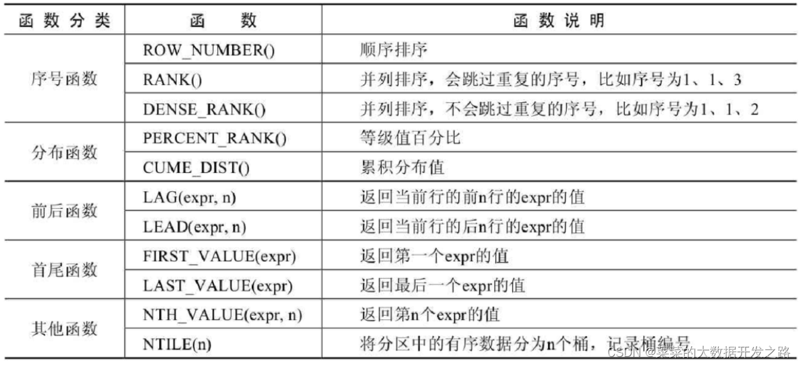

- 表很大，性能下降  
如果表有索引，增删改变慢。查询速度：1个或少量查询依然很快；并发大的时候会受到硬盘带宽影响速度。
- gh-ost
```sql
mysql -h 127.0.0.1 -P 3306 -u root
https://gitee.com/bearkang/mysql-optimization
```
## MYSQL
#### 优化
- 覆盖索引
- 最左前缀原则
- 索引下推 ICP
- 深翻页 join自己
- force index
- 关联表 关联字段要有索引 且类型一致
- 对索引字段做函数操作，可能会破坏索引值的有序性，因此优化器就决定放弃走树搜索功能。
- MRR 因为大多数的数据都是按照主键递增顺序插入得到的，所以我们可以认为，如果按照主键的递增顺序查询的话，对磁盘的读比较接近顺序读，能够提升读性能。
- 在删除数据的时候尽量加 limit。这样不仅可以控制删除数据的条数，让操作更安全，还可以减小加锁的范围。
- 如果你的事务中需要锁多个行，要把最可能造成锁冲突、最可能影响并发度的锁的申请时机尽量往后放。
- 可以考虑通过将一行改成逻辑上的多行来减少锁冲突。比如 10 个记录，这样每次冲突概率变成原来的 1/10，可以减少锁等待个数，也就减少了死锁检测的 CPU 消耗。
- change buffer 只限于用在普通索引的场景下，而不适用于唯一索引。写多读少，效果最好。写入之后马上会做查询，即使满足了条件，将更新先记录在 change buffer，但之后由于马上要访问这个数据页，会立即触发 merge 过程。change buffer 反而起到了副作用。
- 间隙锁的引入，可能会导致同样的语句锁住更大的范围，这其实是影响了并发度的。隔离级别读提交加 binlog_format=row 的组合。业务不需要可重复读的保证。
- 如果你的需求并不需要对结果进行排序，那你可以在 SQL 语句末尾增加 order by null。```select id%10 as m, count(*) as c from t1 group by m order by null;```
- 更新数据都是先读后写的，而这个读，只能读当前的值，称为“当前读”（current read）。
- redo log 主要节省的是随机写磁盘的 IO 消耗（转成顺序写），而 change buffer 主要节省的则是随机读磁盘的 IO 消耗。
- 在数据库设计中，我们非常强调定长存储，因为定长存储的性能更好。
#### 存储引擎
- Innodb：frm是表定义文件，ibd是数据文件
- Myisam：frm是表定义文件，myd是数据文件，myi是索引文件
#### 基础层次
1. 客户端：向数据库发送请求（采用数据库连接池，减少频繁的开关连接）
2. 服务端
    1. 连接器: 控制用户的连接 权限验证
    2. 分析器: 词法分析/语法分析（AST 抽象语法树）
    3. 优化器: 优化SQL语句，规定执行流程（可以查看SQL语句的执行计划，可以采用对应的优化点，来加快查询）
    4. 执行器: SQL语句的实际执行组件
3. 存储引擎：不同的存放位置，不同的文件格式
    1. InnoDB: 内存
    2. MyISAM: 磁盘
    3. Memory: 内存
- 优化
    * RBO 基于规则优化
    * CBO 基于成本优化
#### 常用SQL
```sql
-- 在第一条select执行完后，才得到事务的一致性快照（所有select 都是以第一条为时间点）
START TRANSACTION;
-- 立即得到事务的一致性快照
START TRANSACTION WITH consistent snapshot;
CREATE TABLE IF NOT EXISTS newTabName LIKE tabName
SUBSTRING_INDEX(GROUP_CONCAT(activity_price ORDER BY id DESC), ',', 1)

-- 批量更新
UPDATE mytable 
    SET myfield = CASE id 
        WHEN 1 THEN 'value1'
        WHEN 2 THEN 'value2'
        WHEN 3 THEN 'value3'
    END
WHERE id IN (1, 2, 3);

-- 统计表字段
SELECT a.COLUMN_NAME 字段名,  a.COLUMN_TYPE 类型, a.COLUMN_COMMENT 说明
FROM information_schema.COLUMNS a
WHERE a.TABLE_SCHEMA = 'base' AND a.TABLE_NAME = 'bus_project';
-- 查询有指定字段的表
SELECT
    TABLE_SCHEMA AS 'Database',
        TABLE_NAME AS 'Table'
FROM INFORMATION_SCHEMA.COLUMNS
WHERE
    COLUMN_NAME = 'area_company_id';

SELECT
    t1.customer_mobile, t2.*
FROM
    ques_questionnaire_2023 t1
        JOIN (
        SELECT
            *
        FROM
            sp_send_record_2023
        WHERE
                ( questionnaire_uuid, create_time ) IN ( SELECT questionnaire_uuid, MAX( create_time ) FROM sp_send_record_2023 GROUP BY questionnaire_uuid )) t2 ON t1.uuid = t2.questionnaire_uuid
WHERE
    t1.customer_mobile LIKE '00%'
```

```sql
-- 慢查询日志 设置之后 断开连接重新连
SHOW VARIABLES LIKE 'log_output';
SET GLOBAL log_output = 'TABLE';
    
SHOW VARIABLES LIKE 'slow_query_log';
SET GLOBAL slow_query_log = 'ON';

SHOW GLOBAL VARIABLES LIKE 'long_query_time';
SET GLOBAL long_query_time = 0;

SELECT l.start_time, l.user_host, l.query_time, l.lock_time, CONVERT(l.sql_text USING utf8) as `sql`, l.thread_id
FROM mysql.slow_log l
-- WHERE l.thread_id IN (121, 126)
ORDER BY start_time DESC LIMIT 50;
-- 磁盘IO
SHOW VARIABLES LIKE '%innodb_io_capacity%';
-- 是否刷邻页
SHOW VARIABLES LIKE '%innodb_flush_neighbors%';
-- 重新统计索引信息
ANALYZE TABLE test; 
-- 重建表
ALTER TABLE test ENGINE = INNODB;
-- 大于60s的长事务
SELECT * FROM information_schema.innodb_trx WHERE TIME_TO_SEC(timediff(now(), trx_started)) > 60;
-- 死锁检测
SHOW VARIABLES LIKE 'innodb_deadlock_detect';
-- 死锁超时时间
SHOW VARIABLES LIKE 'innodb_lock_wait_timeout';
```
#### 全文索引
```sql
ALTER TABLE 表名 ADD FULLTEXT INDEX 索引名称 (字段1,字段2,字段3) WITH PARSER ngram;

show VARIABLES like 'ngram_token_size';
my.ini文件下的 [mysqld] 下面加上 ngram_token_size = 2

SELECT * FROM 表名 WHERE MATCH(列名1,列名2) AGAINST(检索内容1 检索内容2);
```
#### 窗口函数

> 函数 OVER ([PARTITION BY 字段名 ORDER BY 字段名 ASC|DESC])  
> 函数 OVER 窗口名 … WInDOW 窗口名 AS ([PARTITION BY 字段名 ORDER BY 字段名 ASC|DESC])

```sql
CREATE TABLE `goods` (
  `id` int NOT NULL AUTO_INCREMENT,
  `category_id` int NOT NULL,
  `category` varchar(50) COLLATE utf8mb4_general_ci NOT NULL,
  `name` varchar(50) COLLATE utf8mb4_general_ci NOT NULL,
  `price` decimal(10,2) NOT NULL,
  `stock` int NOT NULL,
  `upper_time` datetime NOT NULL,
  PRIMARY KEY (`id`)
) ENGINE=InnoDB AUTO_INCREMENT=1 DEFAULT CHARSET=utf8mb4 COLLATE=utf8mb4_general_ci;

INSERT INTO goods ( category_id, category, NAME, price, stock, upper_time )
VALUES
    ( 1, '女装/女士精品', 'T恤', 39.90, 1000, '2020-11-10 00:00:00' ),
    ( 1, '女装/女士精品', '连衣裙', 79.90, 2500, '2020-11-10 00:00:00' ),
    ( 1, '女装/女士精品', '卫衣', 89.90, 1500, '2020-11-10 00:00:00' ),
    ( 1, '女装/女士精品', '牛仔裤', 89.90, 3500, '2020-11-10 00:00:00' ),
    ( 1, '女装/女士精品', '百褶裙', 29.90, 500, '2020-11-10 00:00:00' ),
    ( 1, '女装/女士精品', '呢绒外套', 399.90, 1200, '2020-11-10 00:00:00' ),
    ( 2, '户外运动', '自行车', 399.90, 1000, '2020-11-10 00:00:00' ),
    ( 2, '户外运动', '山地自行车', 1399.90, 2500, '2020-11-10 00:00:00' ),
    ( 2, '户外运动', '登山杖', 59.90, 1500, '2020-11-10 00:00:00' ),
    ( 2, '户外运动', '骑行装备', 399.90, 3500, '2020-11-10 00:00:00' ),
    ( 2, '户外运动', '运动外套', 799.90, 500, '2020-11-10 00:00:00' ),
    ( 2, '户外运动', '滑板', 499.90, 1200, '2020-11-10 00:00:00' );
```
1. 序号函数
```sql
SELECT *, 
	    ROW_NUMBER() OVER (PARTITION BY category_id ORDER BY price DESC) AS row_num
FROM goods;

SELECT *,
       RANK() OVER (PARTITION BY category_id ORDER BY price DESC) AS topPrice
FROM goods;

SELECT *,
       DENSE_RANK() OVER (PARTITION BY category_id ORDER BY price DESC) AS topPrice
FROM goods;


SELECT * FROM (
                  SELECT *,
                         ROW_NUMBER() OVER (PARTITION BY category_id ORDER BY price DESC) AS topPrice
                  FROM goods) tmp
WHERE tmp.topPrice <= 3;

SELECT *,
       DENSE_RANK() OVER (PARTITION BY category_id ORDER BY price DESC) AS topPrice
FROM goods
WHERE category_id = 1
    LIMIT 4;
```
2. 分布函数
```sql
SELECT
	RANK() OVER (PARTITION BY category_id ORDER BY price DESC) AS r,
	PERCENT_RANK() OVER (PARTITION BY category_id ORDER BY price DESC) AS pr,
	id, category_id, category, name, price, stock
FROM goods
WHERE category_id = 1;

SELECT
    RANK() OVER w AS r,
    PERCENT_RANK() OVER w AS pr,
    id, category_id, category, name, price, stock
FROM goods
WHERE category_id = 1 
WINDOW w AS (PARTITION BY category_id ORDER BY price DESC);

SELECT
    CUME_DIST() OVER (PARTITION BY category_id ORDER BY price DESC) AS cd,
    id, category_id, category, name, price, stock
FROM goods;
```
3. 前后函数
```sql
SELECT *,
	LAG(price, 1) OVER (PARTITION BY category_id ORDER BY price DESC) AS pre_price
FROM goods;

SELECT *, price - pre_price
FROM
(
    SELECT *, LAG(price, 1) OVER w AS pre_price
    FROM goods
    WINDOW w AS (PARTITION BY category_id ORDER BY price DESC)
) AS tmp;

SELECT *, LEAD(price, 1) OVER w AS post_price
FROM goods
WINDOW w AS (PARTITION BY category_id ORDER BY price DESC);
```
4. 首位函数
```sql
SELECT *,
	FIRST_VALUE(price) OVER (PARTITION BY category_id ORDER BY price DESC) AS max_price
FROM goods;
```
5. 其他函数
```sql
SELECT *,
    NTH_VALUE(price, 2) OVER w AS second_price,
    NTH_VALUE(price, 3) OVER w AS third_price  
FROM goods
WINDOW w AS (PARTITION BY category_id ORDER BY price);

SELECT NTILE(3) OVER w AS nt, id, category, name, price
FROM goods
WINDOW w AS (PARTITION BY category_id ORDER BY price);
```
## 安装
```shell
# 上传gz包到/opt
cd /opt/
tar -xvf mysql-5.7.40-linux-glibc2.12-x86_64.tar.gz
ln -s mysql-5.7.40-linux-glibc2.12-x86_64 mysql
cd mysql

groupadd mysql
useradd -r -g mysql -s /bin/false mysql
mkdir data
chown -R root:root .

bin/mysqld --initialize --user=mysql --basedir=/opt/mysql --datadir=/opt/mysql/data
bin/mysql_ssl_rsa_setup --datadir=/opt/mysql/data

cd /var/log/
mkdir mysql
chown -R mysql:mysql mysql/

# 编辑配配置文件
vi /etc/my.cnf
basedir=/opt/mysql
datadir=/opt/mysql/data
socket=/var/log/mysql/mysql.sock
log-error=/var/log/mysql/error.log
pid-file=/var/log/mysql/mysql.pid

ln -s /var/log/mysql/mysql.sock /tmp/mysql.sock

# 启动服务
bin/mysqld_safe --user=mysql &

bin/mysql --user=root --password=临时密码 日志里有
# 修改密码和开放权限
set password=password('admin');
grant all privileges on *.* to root@'%' identified by 'admin';
flush privileges;

# 开放防火墙端口
firewall-cmd --zone=public --add-port=3306/tcp --permanent
firewall-cmd --reload
firewall-cmd --list-ports

# 关闭
bin/mysqladmin --user=root --password shutdown

# 开机启动
cp /opt/mysql/support-files/mysql.server /etc/init.d/mysql
chmod +x /etc/init.d/mysql
chkconfig --add mysql
```