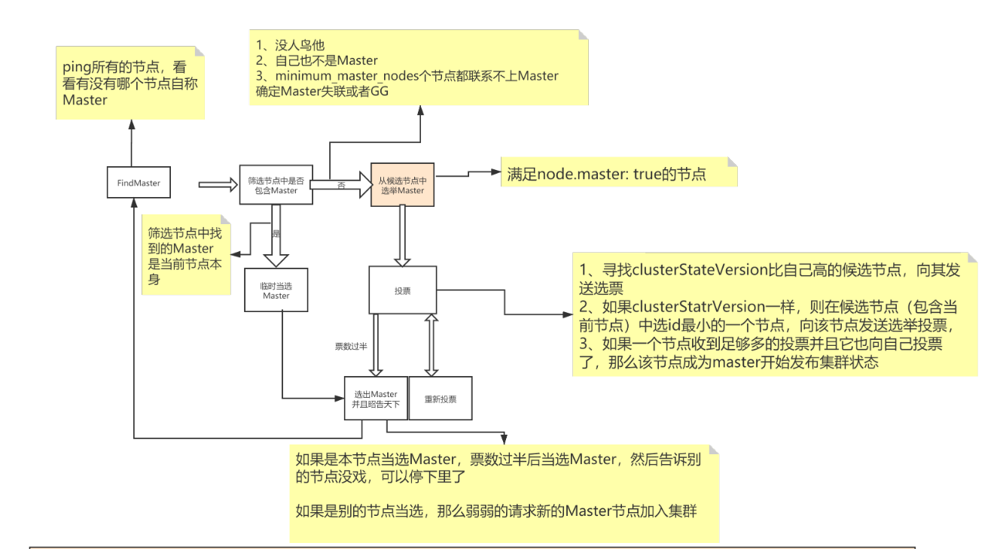
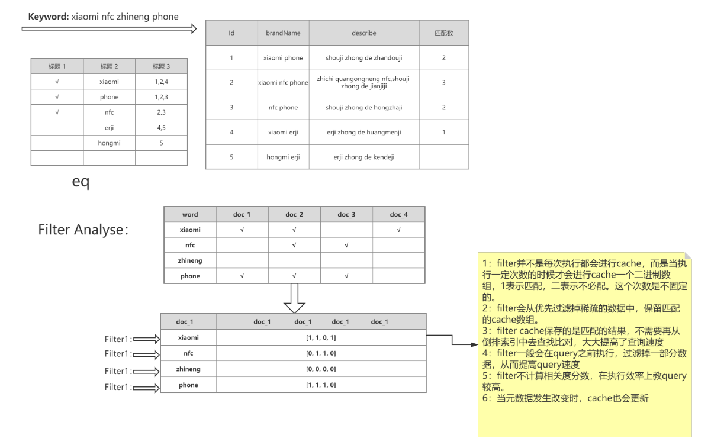
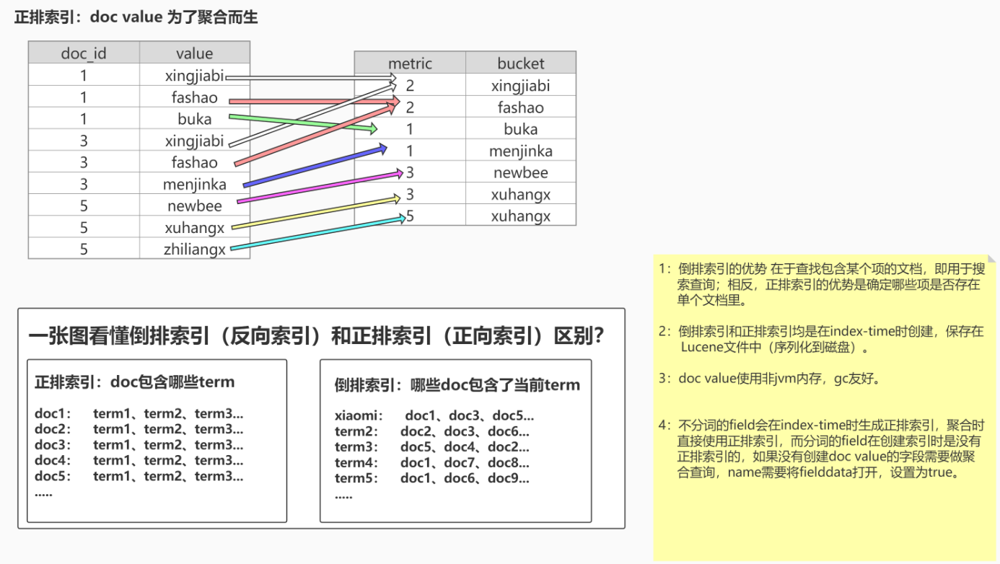
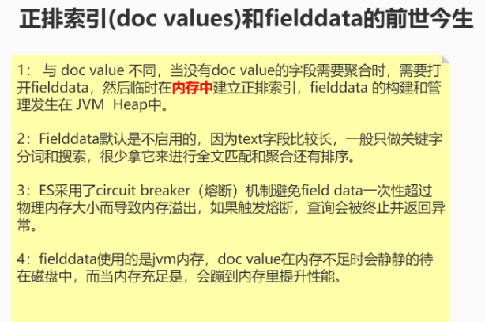

## 基础概念
#### 倒排索引
- 根据关键字建索引 **空间换时间**
1. 包含这个关键词的doc list
2. 关键词在每个doc中出现的次数 TF term frequency
3. 关键词在整个索引中出现的次数 IDF inverse doc frequency **IDF越高 相关度越低**
4. 关键词在当前doc中出现的次数
5. 每个doc的长度，越长相关度越低
6. 包含这个关键词的所有doc的平均长度
#### 优点
- Lucene：jar包，创建倒排索引，提供了复杂的API。单点
- ES 分布式、高性能、高可用、可伸缩、易维护
    1. 面向开发者，屏蔽了Lucene的复杂特性，集群自动发现
    2. 自动维护数据在多个节点上建立
    3. 搜索请求的负载均衡
    4. 自动维护冗余副本
    5. 提供了很多高级功能：复合查询、聚合分析、基于地理位置
    6. 对于大公司，可以构建几百台服务器的大型分布式集群，处理PB级别数据
    7. 全文检索，同义词处理。相关度排名，聚合分析
- Shard 分片
    1. 一个index包含多个Shard，默认5P，默认每个P分配一个R，P的数量在创建索引的时候设置，如果想修改，需要重建索引。
    2. 每个Shard都是一个Lucene实例，有完整的创建索引的处理请求能力。
    3. ES会自动在nodes上为我们做shard均衡。
    4. 一个doc不可能同时存在于多个PShard。可以存在于多个RShard。
    5. P和对应的R不能同时存在于同一个node，所以最低的可用配置是两台节点，互为主备。
- ES容错
    1. Master选举（假如宕机节点是Master）
    2. Replica容错（新的（或者原有）Master节点会将丢失的Primary对应的某个副本提升为Primary）
    3. Master节点会尝试重启故障机
    4. 数据恢复 增量（Master会将宕机期间丢失的数据同步到重启机器对应的分片上去）
#### 节点

- Master node（主节点）  
创建/删除索引，分片均衡。每个集群有且只有一个。尽量避免Master节点node.data=true
- Master-eligible node（候选节点）
- Voting node（投票节点）  
node.voting_only = true 仅投票节点，即使配置了data.master = true，也不会参选, 但是仍然可以作为数据节点。
- Coordinating（协调节点）  
每一个节点都隐式的是一个协调节点，如果同时设置了data.master = false和data.data=false，那么此节点将成为仅协调节点。
- Data node（数据节点）
- Ingest node
- Machine learning node（机器学习节点）
#### node.master和node.data
1. node.master = true node.data = true  
这是ES节点默认配置，既作为候选节点又作为数据节点，这样的节点一旦被选举为Master，压力是比较大的，通常来说Master节点应该只承担较为轻量级的任务，比如创建删除索引，分片均衡等。
2. node.master = true node.data = false  
只作为候选节点，不作为数据节点，可参选Master节点，当选后成为真正的Master节点。
3. node.master = false node.data = false  
既不当候选节点，也不作为数据节点，那就是仅协调节点，负责负载均衡。
4. node.master=false node.data=true  
不作为候选节点，但是作为数据节点，这样的节点主要负责数据存储和查询服务。
#### 总结（如何提高ES分布式系统的可用性以及性能最大化）
1. 每台节点的Shard数量越少，每个shard分配的CPU、内存和IO资源越多，单个Shard的性能越好，当一台机器一个Shard时，单个Shard性能最好。
2. 稳定的Master节点对于群集健康非常重要！理论上讲，应该尽可能的减轻Master节点的压力，分片数量越多，Master节点维护管理shard的任务越重，并且节点可能就要承担更多的数据转发任务，可增加“仅协调”节点来缓解Master节点和Data节点的压力，但是在集群中添加过多的仅协调节点会增加整个集群的负担，因为选择的主节点必须等待每个节点的集群状态更新确认。
3. 反过来说，如果相同资源分配相同的前提下，shard数量越少，单个shard的体积越大，查询性能越低，速度越慢，这个取舍应根据实际集群状况和结合应用场景等因素综合考虑。
4. 数据节点和Master节点一定要分开，集群规模越大，这样做的意义也就越大。
5. 数据节点处理与数据相关的操作，例如CRUD，搜索和聚合。这些操作是I / O，内存和CPU密集型的，所以他们需要更高配置的服务器以及更高的带宽，并且集群的性能冗余非常重要。
6. 由于仅投票节不参与Master竞选，所以和真正的Master节点相比，它需要的内存和CPU较少。但是，所有候选节点以及仅投票节点都可能是数据节点，所以他们都需要快速稳定低延迟的网络。
7. 高可用性（HA）群集至少需要三个主节点，其中至少两个不是仅投票节点。即使其中一个节点发生故障，这样的群集也将能够选举一个主节点。生产环境最好设置3台仅Master候选节点（node.master = true	 node.data = false）
8. 为确保群集仍然可用，集群不能同时停止投票配置中的一半或更多节点。只要有一半以上的投票节点可用，群集仍可以正常工作。这意味着，如果存在三个或四个主节点合格的节点，则群集可以容忍其中一个节点不可用。如果有两个或更少的主机资格节点，则它们必须都保持可用

## 语法
#### 健康检查
- GET /_cluster/health
- GET /_cat/health?v
- GET /_cat/shards?v
#### 索引
- 查询  
GET /index?pretty
- 创建索引  
PUT /index?pretty  
GET /_cat/indices?v
- 删除索引  
DELETE /test01?pretty
#### 数据
- 查询  
GET /product/_search  
GET /index/_doc/id  
`/product/_search?from=0&size=2&sort=price:asc`  
设置了sort，相关度score=null  
`/product/_search?timeout=1ms`  
默认没有timeout，如果设置了timeout，那么会执行timeout机制。Timeout机制：假设用户查询结果有1W条数据，但是需要10s才能查询完毕，但是用户设置了1s的timeout，那么不管当前一共查询到了多少数据，都会在1s后ES讲停止查询，并返回当前数据。
- 插入数据  
    PUT /index/_doc/id
    ```
    PUT /product/_doc/1
    {
        "name" : "xiaomi phone",
        "desc" :  "shouji zhong de zhandouji",
        "price" :  3999,
        "tags": [ "xingjiabi", "fashao", "buka" ]
    }
    PUT /product/_doc/2
    {
        "name" : "xiaomi nfc phone",
        "desc" :  "zhichi quangongneng nfc,shouji zhong de jianjiji",
        "price" :  4999,
        "tags": [ "xingjiabi", "fashao", "gongjiaoka" ]
    }
    PUT /product/_doc/3
    {
        "name" : "nfc phone",
        "desc" :  "shouji zhong de hongzhaji",
        "price" :  2999,
        "tags": [ "xingjiabi", "fashao", "menjinka" ]
    }
    PUT /product/_doc/4
    {
        "name" : "xiaomi erji",
        "desc" :  "erji zhong de huangmenji",
        "price" :  999,
        "tags": [ "low", "bufangshui", "yinzhicha" ]
    }
    PUT /product/_doc/5
    {
        "name" : "hongmi erji",
        "desc" :  "erji zhong de kendeji",
        "price" :  399,
        "tags": [ "lowbee", "xuhangduan", "zhiliangx" ]
    }
    ```
- 更新数据
    1. 部分字段更新  
    POST /index/_doc/id/_update 或 /index/id/_update/id
        ```
        POST /product/_update/4
        {
          "doc": {
            "price": 2999
          }
        }
        ```
    2. 全量更新  
    PUT /index/_doc/id
- 删除数据`延迟删除 删除后立即插入当前id 版本号为删除前+1`  
    DELETE /index/_doc/id
#### Query DSL
- match_all / _source / sort / 分页
    ```
    GET /product/_search
    {
      "query": {
        "match_all": {}
      },
      "_source": [
        "name",
        "price"
      ],
      "from": 0,
      "size": 2,
      "sort": [
        {
          "price": {
            "order": "asc"
          }
        }
      ]
    }
    ```
- match（查询条件会被分词）
    ```
    GET /product/_search
    {
      "query": {
        "match": {
          "name": "phone"
        }
      }
    }
    GET /_analyze
    {
      "analyzer": "standard",
      "text": "xiaomi phone nfc zhineng"
    }
    ```
- multi_match
    ```
    GET /product/_search
    {
      "query": {
        "multi_match": {
          "query": "nfc",
          "fields": [
            "name",
            "desc"
          ]
        }
      }
    }
    ```
- term（完全匹配，也就是精确查询，搜索前不会再对搜索词进行分词拆解。） / terms
    ```
    GET /product/_search
    {
      "query": {
        "term": {
          "name": "nfc phone"
        }
      }
    }
    
    GET /product/_search
    {
      "query": {
        "terms": {
          "name": ["nfc", "phone"]
        }
      }
    }
    ```
- match_phrase（短语搜索，要求所有的分词必须同时出现在文档中，同时位置必须紧邻一致。）
    ```
    GET /product/_search
    {
      "query": {
        "match_phrase": {
          "name": "nfc phone"
        }
      }
    }
    ```
- constant_score
    ```
    GET /product/_search
    {
      "query": {
        "constant_score": {
          "filter": {
              "range": {
                "price": {
                  "gt": 1999
                }
              }
            }
        }
      }
    }
    
    GET /product/_search
    {
      "query": {
        "constant_score": {
          "filter": {
            "bool": {
              "should": [
                {
                  "term": {
                    "name": "xiaomi"
                  }
                },
                {
                  "term": {
                    "name": "nfc"
                  }
                }
              ],
              "must_not": [
                {
                  "term": {
                    "name": "erji"
                  }
                }
              ]
            }
          },
          "boost": 1.2
        }
      }
    }
    ```
- scroll
    ```
    GET /product/_search?scroll=1m
    {
      "query": {
        "match_all": {}
      },
      "size": 2,
      "sort": [
        {
          "price": {
            "order": "asc"
          }
        }
      ]
    }
    
    GET /_search/scroll
    {
      "scroll_id":""
    }
    ```

###### 组合查询
采用more_matches_is_better的机制，因此满足must和should子句的文档将会合并起来计算分值。
- must：必须满足  
子句（查询）必须出现在匹配的文档中，并将有助于得分。
- filter：过滤器 不计算相关度分数，`cache`  
子句（查询）必须出现在匹配的文档中。但是不像 must查询的分数将被忽略。filter子句在filter上下文中执行，这意味着计分被忽略，并且子句被考虑用于缓存。
- should：可能满足 or  
子句（查询）应出现在匹配的文档中。
- must_not：必须不满足 不计算相关度分数 not  
子句（查询）不得出现在匹配的文档中。子句在过滤器上下文中执行，这意味着计分被忽略，并且子句被视为用于缓存。由于忽略计分，因此将不返回所有文档的分数。
- minimum_should_match  
指定should返回的文档必须匹配的子句的数量或百分比。如果bool查询包含至少一个should子句，而没有must或 filter子句，则默认值为1。否则，默认值为0
```
GET /product/_search
{
  "query": {
    "bool": {
      "must": [
        {
          "match": {
            "name": "xiaomi"
          }
        },
        {
          "match": {
            "desc": "shouji"
          }
        }
      ],
      "filter": [
        {
          "match_phrase": {
            "name": "xiaomi phone"
          }
        },
        {
          "range": {
            "price": {
              "gt": 1999
            }
          }
        }
      ]
    }
  }
}
```

#### 批量操作
- _mget
    ```
    GET /_mget
    {
      "docs": [
        {
          "_index": "product",
          "_id": 1
        },
        {
          "_index": "product",
          "_id": 2
        }
      ]
    }
    GET /product/_mget
    {
      "docs": [
        {
          "_id": 1
        },
        {
          "_id": 2
        }
      ]
    }
    GET /product/_mget
    {
      "ids": [1,2]
    }
    ```
- bulk：批量增删改
 1. POST /_bulk
 2. POST /index/_bulk
    {"action": {"metadata"}}
    {"data"}
 3. Operate：
    1. create：PUT /index/_create/id/，强制创建（是否指定id）
    2. delete：删除（lazy delete原理）
    3. index：可以是创建，也可以是全量替换
    4. update：执行partial update（全量替换，部分替换）
#### 聚合查询
```
GET /product/_search
{
  "query": {
    "bool": {
      "filter": [
        {
          "range": {
            "price": {
              "gte": 1000
            }
          }
        }
      ]
    }
  },
  "aggs": {
    "group_by_tags": {
      "terms": {
        "field": "tags.keyword",
        "order": {
          "avg_price": "desc"
        }
      },
      "aggs": {
        "avg_price": {
          "avg": {
            "field": "price"
          }
        }
      }
    }
  },
  "size": 0
}
GET /product/_search
{
  "aggs": {
    "group_by_range_price": {
      "range": {
        "field": "price",
        "ranges": [
          {
            "from": 100,
            "to": 1000
          },
          {
            "from": 1000,
            "to": 3000
          },
          {
            "from": 3000
          }
        ]
      },
      "aggs": {
        "avg_price": {
          "avg": {
            "field": "price"
          }
        }
      }
    }
  },
  "size": 0
}
```
## mapping
- GET /index/_mappings
- GET /index/_mapping/field/fieldName

mapping就是ES数据字段field的type元数据，ES在创建索引的时候，dynamic mapping会自动为不同的数据指定相应mapping，mapping中包含了字段的类型、搜索方式（exact value或者full text）、分词器等。
#### Dynamic mapping
Es的mapping_type是由JSON分析器检测数据类型，而Json没有隐式类型转换（integer=>long or float=> double）,所以dynamic mapping会选择一个比较宽的数据类型。
#### 搜索方式
1. exact value 精确匹配：在倒排索引过程中，分词器会将field作为一个整体创建到索引中
2. full text全文检索：分词、近义词同义词、混淆词、大小写、词性、过滤、时态转换等（normaliztion）
#### ES数据类型
- 数字类型：
    1. long, integer, short, byte, double, float, half_float, scaled_float
    2. 在满足需求的情况下，尽可能选择范围小的数据类型
- 字符串
    1. keyword：适用于索引结构化的字段，可以用于过滤、排序、聚合。keyword类型的字段只能通过精确值（exact value）搜索到。Id应该用keyword  
    text：当一个字段是要被全文搜索的，比如Email内容、产品描述，这些字段应该使用text类型。设置text类型以后，字段内容会被分析，在生成倒排索引以前，字符串会被分析器分成一个一个词项。  
    text类型的字段不用于排序，很少用于聚合。（字段数据会占用大量堆空间，尤其是在加载text字段时。字段数据一旦加载到堆中，就在该段的生命周期内保持在那里。同样，加载字段数据是一个昂贵的过程，可能导致用户遇到延迟问题。这就是默认情况下禁用字段数据的原因）
    2. 有时同一字段中同时具有全文本（text）和关键字（keyword）版本会很有用：一个用于全文本搜索，另一个用于聚合和排序。
- date（时间类型）：exact value
- boolean（布尔类型）
- binary（二进制）：binary
- range（区间类型）：integer_range、float_range、long_range、double_range、date_range
- object：用于单个JSON对象
- nested：用于JSON对象数组
- Geo-point：纬度/经度积分
- Geo-shape：用于多边形等复杂形状
#### 创建索引mapping
```
// 和索引一起创建
PUT /index 
{
    "mappings": {
        "properties": {
            "field": {
                "mapping_parameter": "parameter_value"
        }
      }
    }
}
// 先有空索引 再添加mapping 已存在的字段有的属性可修改 有的不可以
PUT /index/_mappings 
{
    "properties": {
        "field": {
            "mapping_parameter": "parameter_value"
        }
    }
}
```
###### Mapping parameters
- dynamic：控制是否可以动态添加新字段
    1. true 新检测到的字段将添加到映射中。（默认）
    2. false 新检测到的字段将被忽略。这些字段将不会被索引，因此将无法搜索，但仍会出现在_source返回的匹配项中。这些字段不会添加到映射中，必须显式添加新字段。
    3. strict 如果检测到新字段，则会引发异常并拒绝文档。必须将新字段显式添加到映射中
- index：是否对创建对当前字段创建索引，默认true，如果不创建索引，该字段不会通过索引被搜索到,但是仍然会在source元数据中展示
- **doc_values**：为了提升排序和聚合效率，默认true，如果确定不需要对字段进行排序或聚合，也不需要通过脚本访问字段值，则可以禁用doc值以节省磁盘空间（不支持text和annotated_text）
- **fielddata**：查询时内存数据结构，在首次用当前字段聚合、排序或者在脚本中使用时，需要字段为fielddata数据结构，并且创建正排索引保存到JVM堆中
- analyzer：指定分析器（character filter、tokenizer、Token filters）
- boost：对当前字段相关度的评分权重，默认1
- coerce：是否允许强制类型转换  true "1" => 1   false "1"=< 1
- copy_to：
    ```
    "field": {
        "type": "text",
        "copy_to": "other_field_name"
    }
    ```
- eager_global_ordinals：用于聚合的字段上，优化聚合性能。  
Frozen indices（冻结索引）：有些索引使用率很高，会被保存在内存中，有些使用率特别低，宁愿在使用的时候重新创建，在使用完毕后丢弃数据，Frozen indices的数据命中频率小，不适用于高搜索负载，数据不会被保存在内存中，堆空间占用比普通索引少得多，Frozen indices是只读的，请求可能是秒级或者分钟级。eager_global_ordinals不适用于Frozen indices
- enable：是否创建倒排索引，可以对字段操作，也可以对索引操作，如果不创建索引，让然可以检索并在_source元数据中展示，谨慎使用，该状态无法修改。
    ```
    PUT /index 
    {
        "mappings": {
            "enabled": false
        }
    }
    PUT /index 
    {
        "mappings": {
            "properties": {
                "session_data": {
                    "type": "object",
                    "enabled": false
                }
            }
        }
    }
    ```
- fields：给field创建多字段，用于不同目的（全文检索或者聚合分析排序）
- format：格式化
    ```
    "date": {
        "type": "date",
        "format": "yyyy-MM-dd"
    }
    ```
- ignore_above：超过长度将被忽略
- ignore_malformed：忽略类型错误
- index_options：控制将哪些信息添加到反向索引中以进行搜索和突出显示。仅用于text字段
- index_phrases：提升exact_value查询速度，但是要消耗更多磁盘空间
- index_prefixes：前缀搜索
    1. min_chars：前缀最小长度，>0，默认2（包含）
    2.  max_chars：前缀最大长度，<20，默认5（包含）
    ```
    "index_prefixes": {
        "min_chars" : 1,
        "max_chars" : 10
    }
    ```
- meta：附加元数据
- normalizer
- norms：是否禁用评分（在filter和聚合字段上应该禁用）。
- null_value：为null值设置默认值
- position_increment_gap
- properties：除了mapping还可用于object的属性设置
- search_analyzer：设置单独的查询时分析器：
- similarity：为字段设置相关度算法，支持BM25、claassic（TF-IDF）、boolean
- store：设置字段是否仅查询
- term_vector
###### 正向索引
- 正向索引（doc values ）VS倒排索引：
    1. 概念：从广义来说，doc values 本质上是一个序列化的 列式存储 。列式存储 适用于聚合、排序、脚本等操作，所有的数字、地理坐标、日期、IP 和不分析（ not_analyzed ）字符类型都会默认开启。
    2. 特点：倒排索引的优势 在于查找包含某个项的文档，相反，如果用它确定哪些项是否存在单个文档里。
    3. 优化：es官方是建议，es大量是基于os cache来进行缓存和提升性能的，不建议用jvm内存来进行缓存，那样会导致一定的gc开销和oom问题，给jvm更少的内存，给os cache更大的内存。比如64g服务器，给jvm最多4~16g（1/16~1/4），os cache可以提升doc value和倒排索引的缓存和查询效率。

- fielddata：查询时内存数据结构


## API
- public interface TestDocMapper extends ElasticsearchRepository<TestDoc, Long> 这种声明的Doc会在容器启动时创建索引
- Doc 创建mapping时类型为auto的不能创建