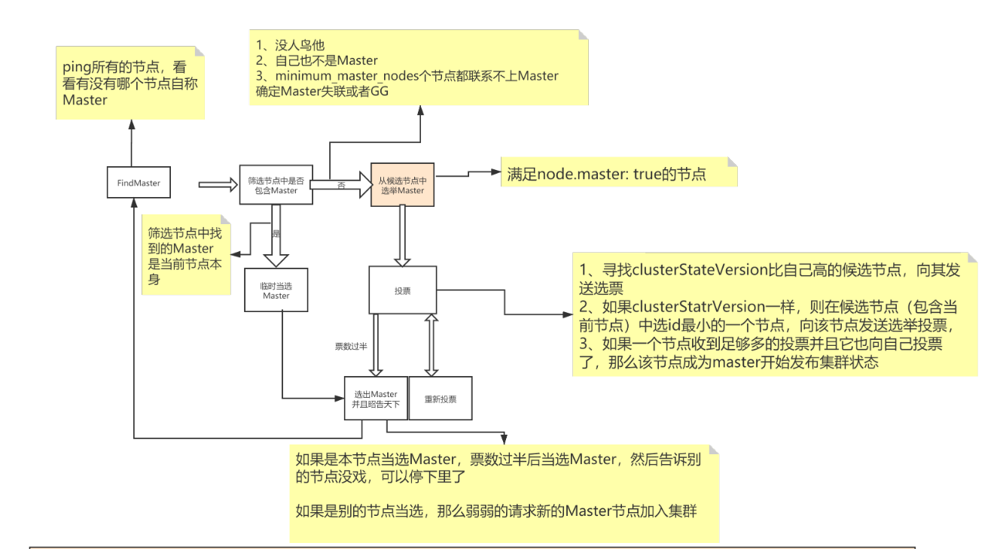

## 基础概念
- 倒排索引：根据关键字建索引 **空间换时间**
    1. 包含这个关键词的doc list
    2. 关键词在每个doc中出现的次数 TF term frequency
    3. 关键词在整个索引中出现的次数 IDF inverse doc frequency **IDF越高 相关度越低**
    4. 关键词在当前doc中出现的次数
    5. 每个doc的长度，越长相关度越低
    6. 包含这个关键词的所有doc的平均长度
#### 优点
- Lucene：jar包，创建倒排索引，提供了复杂的API。单点
- ES 分布式、高性能、高可用、可伸缩、易维护
    1. 面向开发者，屏蔽了Lucene的复杂特性，集群自动发现
    2. 自动维护数据在多个节点上建立
    3. 搜索请求的负载均衡
    4. 自动维护冗余副本
    5. 提供了很多高级功能：复合查询、聚合分析、基于地理位置
    6. 对于大公司，可以构建几百台服务器的大型分布式集群，处理PB级别数据
    7. 全文检索，同义词处理。相关度排名，聚合分析
- Shard 分片
    1. 一个index包含多个Shard，默认5P，默认每个P分配一个R，P的数量在创建索引的时候设置，如果想修改，需要重建索引。
    2. 每个Shard都是一个Lucene实例，有完整的创建索引的处理请求能力。
    3. ES会自动在nodes上为我们做shard均衡。
    4. 一个doc不可能同时存在于多个PShard。可以存在于多个RShard。
    5. P和对应的R不能同时存在于同一个node，所以最低的可用配置是两台节点，互为主备。
- ES容错
    1. Master选举（假如宕机节点是Master）
    2. Replica容错（新的（或者原有）Master节点会将丢失的Primary对应的某个副本提升为Primary）
    3. Master节点会尝试重启故障机
    4. 数据恢复 增量（Master会将宕机期间丢失的数据同步到重启机器对应的分片上去）
#### 节点

- Master node（主节点）  
创建/删除索引，分片均衡。每个集群有且只有一个。尽量避免Master节点node.data=true
- Master-eligible node（候选节点）
- Voting node（投票节点）  
node.voting_only = true 仅投票节点，即使配置了data.master = true，也不会参选, 但是仍然可以作为数据节点。
- Coordinating（协调节点）  
每一个节点都隐式的是一个协调节点，如果同时设置了data.master = false和data.data=false，那么此节点将成为仅协调节点。
- Data node（数据节点）
- Ingest node
- Machine learning node（机器学习节点）
#### 配置node.master和node.data
1. node.master = true node.data = true  
这是ES节点默认配置，既作为候选节点又作为数据节点，这样的节点一旦被选举为Master，压力是比较大的，通常来说Master节点应该只承担较为轻量级的任务，比如创建删除索引，分片均衡等。
2. node.master = true node.data = false  
只作为候选节点，不作为数据节点，可参选Master节点，当选后成为真正的Master节点。
3. node.master = false node.data = false  
既不当候选节点，也不作为数据节点，那就是仅协调节点，负责负载均衡。
4. node.master=false node.data=true  
不作为候选节点，但是作为数据节点，这样的节点主要负责数据存储和查询服务。

## 语法
- 健康检查
    1. GET /_cluster/health
    2. GET /_cat/health?v
    3. GET /_cat/shards?v
#### 索引
- 查询  
    GET /index?pretty
- 创建索引  
    PUT /index?pretty  
    GET /_cat/indices?v
- 删除索引  
    DELETE /test01?pretty
#### 数据
- 查询  
    GET /product/_search  
    `/product/_search?sort=price:asc`  
    GET /index/_doc/id
- 插入数据  
    PUT /index/_doc/id
    ```
    PUT /product/_doc/1
    {
        "name" : "xiaomi phone",
        "desc" :  "shouji zhong de zhandouji",
        "price" :  3999,
        "tags": [ "xingjiabi", "fashao", "buka" ]
    }
    PUT /product/_doc/2
    {
        "name" : "xiaomi nfc phone",
        "desc" :  "zhichi quangongneng nfc,shouji zhong de jianjiji",
        "price" :  4999,
        "tags": [ "xingjiabi", "fashao", "gongjiaoka" ]
    }
    PUT /product/_doc/3
    {
        "name" : "nfc phone",
        "desc" :  "shouji zhong de hongzhaji",
        "price" :  2999,
        "tags": [ "xingjiabi", "fashao", "menjinka" ]
    }
    PUT /product/_doc/4
    {
        "name" : "xiaomi erji",
        "desc" :  "erji zhong de huangmenji",
        "price" :  999,
        "tags": [ "low", "bufangshui", "yinzhicha" ]
    }
    PUT /product/_doc/5
    {
        "name" : "hongmi erji",
        "desc" :  "erji zhong de kendeji",
        "price" :  399,
        "tags": [ "lowbee", "xuhangduan", "zhiliangx" ]
    }
    ```
- 更新数据
    1. 部分字段更新  
    POST /index/_doc/id/_update 或 /index/id/_update/id
    ```
    POST /product/_update/4
    {
      "doc": {
        "price": 2999
      }
    }
    ```
    2. 全量更新  
    PUT /index/_doc/id
- 删除数据`延迟删除 删除后立即插入当前id 版本号为删除前+1`  
    DELETE /index/_doc/id
#### Query DSL
    ```
    GET /product/_search
    {
      "query": {
        "match": {
          "name": "phone"
        }
      },
      "sort": [
        {
          "price": {
            "order": "asc"
          }
        }
      ]
    }
    ```