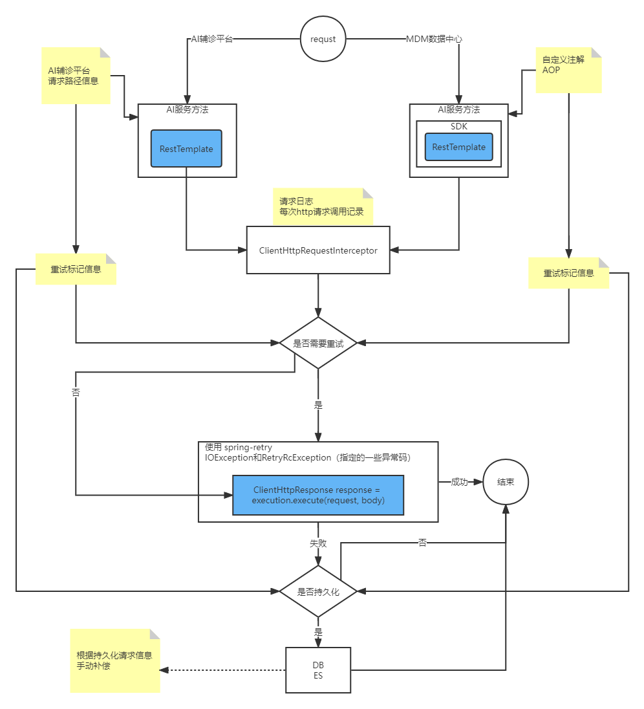

# 网关

## 网关配置URL级别超时时间

SpringCloud 整合Zuul 在使用Ribbon（RibbonRoutingFilter）请求，有关超时时间最细粒度的配置是到应用

```
#serviceId 如果不指定到具体服务 配置全局的话 直接删除此级别
service-consumer:
  # 负载均衡（实际请求）的时间 
  ribbon:
    ReadTimeout: 1000
    ConnectTimeout: 1000
# 熔断时间
hystrix:
  command:
  	#serviceId 如果不指定到具体服务 配置全局的话 此处为default
    service-consumer:
      execution:
        isolation:
          thread:
            timeoutInMilliseconds: 3000
```

- service-consumer 是routes（路由规则）配置中的serviceId


下面是计算hystrixTimeout的代码实现，如果没有配置hystrixTimeout则根据ribbon的一些配置参数计算。

两个时间都要满足，请求才能不超时。从默认的实现看也是这样，如果显示配置了hystrixTimeout的值且小于ribbonTimeout 会产生一个警告日志。AbstractRibbonCommand类实现如下：

```java
protected static int getHystrixTimeout(IClientConfig config, String commandKey) {
	// 默认实现 ribbonTimeout = (ribbonReadTimeout + ribbonConnectTimeout)* (maxAutoRetries + 1) * (maxAutoRetriesNextServer + 1)
	int ribbonTimeout = getRibbonTimeout(config, commandKey);
	DynamicPropertyFactory dynamicPropertyFactory = DynamicPropertyFactory
			.getInstance();
	int defaultHystrixTimeout = dynamicPropertyFactory.getIntProperty(
			"hystrix.command.default.execution.isolation.thread.timeoutInMilliseconds",
			0).get();
	int commandHystrixTimeout = dynamicPropertyFactory
			.getIntProperty("hystrix.command." + commandKey
					+ ".execution.isolation.thread.timeoutInMilliseconds", 0)
			.get();
	int hystrixTimeout;
	if (commandHystrixTimeout > 0) {
		hystrixTimeout = commandHystrixTimeout;
	}
	else if (defaultHystrixTimeout > 0) {
		hystrixTimeout = defaultHystrixTimeout;
	}
	else {
		hystrixTimeout = ribbonTimeout;
	}
	# 警告日志
	if (hystrixTimeout < ribbonTimeout) {
		LOGGER.warn("The Hystrix timeout of " + hystrixTimeout + "ms for the command "
				+ commandKey
				+ " is set lower than the combination of the Ribbon read and connect timeout, "
				+ ribbonTimeout + "ms.");
	}
	return hystrixTimeout;
}
```


提供的配置不能解决需求，百度一下[相关解决方案](https://segmentfault.com/a/1190000009979859)

RibbonRoutingFilter 是zuul中根据serviceId方式请求的类，核心方法如下：

```java
// run 方式是filter满足执行条件后执行逻辑的方法
public Object run() {
	RequestContext context = RequestContext.getCurrentContext();
	this.helper.addIgnoredHeaders();
	try {
		RibbonCommandContext commandContext = buildCommandContext(context);
		ClientHttpResponse response = forward(commandContext);
		setResponse(response);
		return response;
	}
	catch (ZuulException ex) {
		throw new ZuulRuntimeException(ex);
	}
	catch (Exception ex) {
		throw new ZuulRuntimeException(ex);
	}
}

protected ClientHttpResponse forward(RibbonCommandContext context) throws Exception {
	Map<String, Object> info = this.helper.debug(context.getMethod(),
			context.getUri(), context.getHeaders(), context.getParams(), context.getRequestEntity());
			
	// RibbonCommand 是Ribbon整合Hystrix的一个命令，请求的所有参数在ribbonCommandFactory.create(context)这一步已经封装好，command.execute()已经开始执行请求了。
	RibbonCommand command = this.ribbonCommandFactory.create(context);
	try {
		ClientHttpResponse response = command.execute();
		this.helper.appendDebug(info, response.getRawStatusCode(),
				response.getHeaders());
		return response;
	}
	catch (HystrixRuntimeException ex) {
		return handleException(info, ex);
	}
}
```

HttpClientRibbonCommandFactory中创建Command的方法如下：直接 new HttpClientRibbonCommand

```java
public HttpClientRibbonCommand create(final RibbonCommandContext context) {
	FallbackProvider zuulFallbackProvider = getFallbackProvider(
			context.getServiceId());
	final String serviceId = context.getServiceId();
	final RibbonLoadBalancingHttpClient client = this.clientFactory
			.getClient(serviceId, RibbonLoadBalancingHttpClient.class);
	client.setLoadBalancer(this.clientFactory.getLoadBalancer(serviceId));

	return new HttpClientRibbonCommand(serviceId, client, context, zuulProperties,
			zuulFallbackProvider, clientFactory.getClientConfig(serviceId));
}
```

HttpClientRibbonCommand中创建Request的方法如下：直接 new RibbonApacheHttpRequest

```java
protected RibbonApacheHttpRequest createRequest() throws Exception {
	return new RibbonApacheHttpRequest(this.context);
}
```

> RibbonRoutingFilter中ribbonCommandFactory是从IOC容器中注入的，RibbonCommandFactory创建HttpClientRibbonCommand，HttpClientRibbonCommand创建RibbonApacheHttpRequest都是直接new的。


RibbonApacheHttpRequest创建request的方法如下：

```java
public HttpUriRequest toRequest(final RequestConfig requestConfig) {
	final RequestBuilder builder = RequestBuilder.create(this.context.getMethod());
	builder.setUri(this.uri);
	for (final String name : this.context.getHeaders().keySet()) {
		final List<String> values = this.context.getHeaders().get(name);
		for (final String value : values) {
			builder.addHeader(name, value);
		}
	}

	for (final String name : this.context.getParams().keySet()) {
		final List<String> values = this.context.getParams().get(name);
		for (final String value : values) {
			builder.addParameter(name, value);
		}
	}

	if (this.context.getRequestEntity() != null) {
		final BasicHttpEntity entity;
		entity = new BasicHttpEntity();
		entity.setContent(this.context.getRequestEntity());
		// if the entity contentLength isn't set, transfer-encoding will be set
		// to chunked in org.apache.http.protocol.RequestContent. See gh-1042
		Long contentLength = this.context.getContentLength();
		if ("GET".equals(this.context.getMethod())
				&& (contentLength == null || contentLength < 0)) {
			entity.setContentLength(0);
		}
		else if (contentLength != null) {
			entity.setContentLength(contentLength);
		}
		builder.setEntity(entity);
	}

    // 这里预留了一个自定义接口RequestCustomizers在生成RibbonRoutingFilter实例的时候可以注入 但是这里只能修改一些请求header信息 超时参数又会被下面的setConfig给覆盖掉
	customize(this.context.getRequestCustomizers(), builder);

	builder.setConfig(requestConfig);
	return builder.build();
}

```

在使用RequestCustomizers走不通之后只能扩展此类，最后使用扩展的类创建request

```java
@Slf4j
class CustomRibbonApacheHttpRequest extends RibbonApacheHttpRequest {

    private final UrlCustomProperties urlCustomProperties;

    public CustomRibbonApacheHttpRequest(RibbonCommandContext context, UrlCustomProperties urlCustomProperties) {
        super(context);
        this.urlCustomProperties = urlCustomProperties;
    }

    @Override
    public HttpUriRequest toRequest(RequestConfig requestConfig) {
        HttpUriRequest request = super.toRequest(requestConfig);

        // 满足配置 重新设置请求的超时时间
        if (isMatch(context, urlCustomProperties) && request instanceof HttpRequestBase) {
            HttpRequestBase requestBase = (HttpRequestBase) request;
            RequestConfig.Builder builder = RequestConfig.copy(requestConfig);

            if (urlCustomProperties.getConnectTimeout() > 0) {
                builder.setConnectTimeout(urlCustomProperties.getConnectTimeout());
            }
            if (urlCustomProperties.getSocketTimeout() > 0) {
                builder.setSocketTimeout(urlCustomProperties.getSocketTimeout());
            }

            RequestConfig config = builder.build();
            requestBase.setConfig(config);
            log.info("ribbon: 更新[{}]{}超时时间 ConnectTimeout = {}, SocketTimeout = {}", context.getServiceId(), uri.getRawPath(), config.getConnectTimeout(), config.getSocketTimeout());
        }

        return request;
    }

}
```

其中RibbonTimeoutProperties是一个自定义的配置项包装类，配置项格式如下：

```
url-custom:
	connect-timeout: 2000
	socket-timeout: 120000
	urlMap:
		ima-management:
			- '/{version}/pt/client/file/upload'
```

> CustomRibbonApacheHttpRequest继承类原有的RibbonApacheHttpRequest类，因为我发现再调用父类的toRequest方法之后依然可以重新setConfig。这样就不用把父类中原有的逻辑再复制一份，只需匹配到我的配置项之后，重新设置ConnectTimeout和SocketTimeout即可。至此，只需要最后使用扩展的类就可以实现修改Ribbon请求时候的两个超时参数。


回到一开始提到知识，如果只是Ribbon超时时间足够长，Hystrix熔断时间较短，一样不成功。回到上面AbstractRibbonCommand类getHystrixTimeout的方法，只能在调用这个方法的方法里做修改:

```java
private static HystrixCommandProperties.Setter createSetter(IClientConfig config, String commandKey, ZuulProperties zuulProperties,
                                                                RibbonCommandContext context, UrlCustomProperties urlCustomProperties, boolean isMatch) {
	int hystrixTimeout = getHystrixTimeout(config, commandKey);
	/*
	 * 重新设置hystrix的超时时间 如果不设置且小于ribbon超时时间 那么配置的接口的超时时间一样没意义
	 * 这里暂时设置为 SocketTimeout + ConnectTimeout
	 */
	if (isMatch && hystrixTimeout < urlCustomProperties.getSocketTimeout() + urlCustomProperties.getConnectTimeout()) {
		final String serviceId = context.getServiceId();
		final String url = context.getUri();
		hystrixTimeout = urlCustomProperties.getSocketTimeout() + urlCustomProperties.getConnectTimeout();
		log.info("hystrix: 更新[{}]{}超时时间 {}", serviceId, url, hystrixTimeout);
	}

	return HystrixCommandProperties.Setter()
			.withExecutionIsolationStrategy(zuulProperties.getRibbonIsolationStrategy())
			.withExecutionTimeoutInMilliseconds(hystrixTimeout);
}
```

if里面是添加的逻辑，其他的都不变。因为这些逻辑都是在构造方法里调用的，所以定义的都是static方法，扩展的类CustomHttpClientRibbonCommand不得不复制一些AbstractRibbonCommand类放到自己类中，因为父类的方法定义的都protected。

到此，两个方面的参数都重新设置了，开始测试。在使用默认配置和配置了全局的ribbon和hystrix的超时时间后都没问题，在配置了应用级别后，出现了hystrix超时的异常。在确定了计算的hystrixTimeout没问题之后，debug代码，跟踪这个参数最后怎么设置的，最后在父类AbstractCommand的构造方法中发现了一个方法，原来这里做了一个map缓存，如果缓存中有这个应用的配置，就不会使用形参。

```java
public static HystrixCommandProperties getCommandProperties(HystrixCommandKey key, HystrixCommandProperties.Setter builder) {
	HystrixPropertiesStrategy hystrixPropertiesStrategy = HystrixPlugins.getInstance().getPropertiesStrategy();
	String cacheKey = hystrixPropertiesStrategy.getCommandPropertiesCacheKey(key, builder);
	if (cacheKey != null) {
		HystrixCommandProperties properties = commandProperties.get(cacheKey);
		if (properties != null) {
			return properties;
		} else {
			if (builder == null) {
				builder = HystrixCommandProperties.Setter();
			}
			// create new instance
			properties = hystrixPropertiesStrategy.getCommandProperties(key, builder);
			// cache and return
			HystrixCommandProperties existing = commandProperties.putIfAbsent(cacheKey, properties);
			if (existing == null) {
				return properties;
			} else {
				return existing;
			}
		}
	} else {
		// no cacheKey so we generate it with caching
		return hystrixPropertiesStrategy.getCommandProperties(key, builder);
	}
}
```

所以只能在传入的HystrixCommandKey做手脚，针对配置了url级别超时的请求，不使用默认的key。这里第一版的实现是每个接口一个key，但其实公用一个时间配置，所以最后修改为一个固定的key。可以根据需求修改为接口维度、应用维度，清空缓存key的Listener跟着调整就可以。

```java
private static String getCommandKey(String commandKey, RibbonCommandContext context, UrlCustomProperties urlCustomProperties) {
	return isMatch(context, urlCustomProperties) ? KEY : commandKey;
}
```

因为有缓存，所以为了支持配置项热更新，在配置项修改后要清空该key

```java
@Slf4j
public class HystrixConfigRefreshListener {

    private static final String FIELD_COMMAND_PROPERTIES = "commandProperties";

    @EventListener
    public void refresh(EnvironmentChangeEvent event) {
        List<String> keys = event.getKeys().stream().filter(key -> key.startsWith(PREFIX)).collect(Collectors.toList());
        if (CollectionUtils.isEmpty(keys)) {
            return;
        }

        log.info("配置项刷新: {}", keys);

        try {
            Field field = HystrixPropertiesFactory.class.getDeclaredField(FIELD_COMMAND_PROPERTIES);
            ReflectionUtils.makeAccessible(field);
            Object obj = field.get(null);

            ConcurrentHashMap<String, HystrixCommandProperties> map = (ConcurrentHashMap<String, HystrixCommandProperties>) obj;
            if (map.containsKey(KEY)) {
                map.remove(KEY);
                log.info("hystrix配置缓存删除 {}", KEY);
            }

            log.info("更新hystrix配置缓存成功");
        } catch (NoSuchFieldException | IllegalAccessException e) {
            log.error("更新hystrix配置缓存失败", e);
        }
    }

}
```

至此扩展的CustomHttpClientRibbonCommand和CustomRibbonApacheHttpRequest类的扩展逻辑代码已贴上，CustomHttpClientRibbonCommandFactory的代码如下：

```java
class CustomHttpClientRibbonCommandFactory extends AbstractRibbonCommandFactory {

    private final SpringClientFactory clientFactory;
    private final ZuulProperties zuulProperties;
    private final UrlCustomProperties urlCustomProperties;

    public CustomHttpClientRibbonCommandFactory(SpringClientFactory clientFactory, ZuulProperties zuulProperties, Set<FallbackProvider> fallbackProviders,
                                                UrlCustomProperties urlCustomProperties) {
        super(fallbackProviders != null ? fallbackProviders : Collections.emptySet());
        this.clientFactory = clientFactory;
        this.zuulProperties = zuulProperties;
        this.urlCustomProperties = urlCustomProperties;
    }

    @Override
    public RibbonCommand create(RibbonCommandContext context) {
        FallbackProvider fallbackProvider = getFallbackProvider(context.getServiceId());
        final String serviceId = context.getServiceId();
        final RibbonLoadBalancingHttpClient client = clientFactory.getClient(serviceId, RibbonLoadBalancingHttpClient.class);
        client.setLoadBalancer(clientFactory.getLoadBalancer(serviceId));
        final IClientConfig config = clientFactory.getClientConfig(serviceId);

        return new CustomHttpClientRibbonCommand(serviceId, client, context, zuulProperties,
                fallbackProvider, config, urlCustomProperties);
    }

}
```

三个扩展类逻辑就是这些。默认的RibbonCommandFactory有几种实现，代码如下。**当前的扩展只是针对使用HttpClientRibbonCommandFactory的场景**，如果使用其他方式，同样方式扩展即可。

*这里解决的场景是网关调用一个层级服务超时的情况。如果网关->A->B，A调用B服务超时的情况不在此场景内。*

```java
public class RibbonCommandFactoryConfiguration {

	@Configuration
	@ConditionalOnRibbonRestClient
	protected static class RestClientRibbonConfiguration {

		@Autowired(required = false)
		private Set<FallbackProvider> zuulFallbackProviders = Collections.emptySet();

		@Bean
		@ConditionalOnMissingBean
		public RibbonCommandFactory<?> ribbonCommandFactory(
				SpringClientFactory clientFactory, ZuulProperties zuulProperties) {
			return new RestClientRibbonCommandFactory(clientFactory, zuulProperties,
					zuulFallbackProviders);
		}

	}

	@Target({ ElementType.TYPE, ElementType.METHOD })
	@Retention(RetentionPolicy.RUNTIME)
	@Documented
	@Conditional(OnRibbonHttpClientCondition.class)
	@interface ConditionalOnRibbonHttpClient {

	}

	private static class OnRibbonHttpClientCondition extends AnyNestedCondition {

		OnRibbonHttpClientCondition() {
			super(ConfigurationPhase.PARSE_CONFIGURATION);
		}

		@ConditionalOnProperty(name = "ribbon.httpclient.enabled", matchIfMissing = true)
		static class RibbonProperty {

		}

	}

	@Target({ ElementType.TYPE, ElementType.METHOD })
	@Retention(RetentionPolicy.RUNTIME)
	@Documented
	@Conditional(OnRibbonOkHttpClientCondition.class)
	@interface ConditionalOnRibbonOkHttpClient {

	}

	@Configuration
	@ConditionalOnRibbonOkHttpClient
	@ConditionalOnClass(name = "okhttp3.OkHttpClient")
	protected static class OkHttpRibbonConfiguration {

		@Autowired(required = false)
		private Set<FallbackProvider> zuulFallbackProviders = Collections.emptySet();

		@Bean
		@ConditionalOnMissingBean
		public RibbonCommandFactory<?> ribbonCommandFactory(
				SpringClientFactory clientFactory, ZuulProperties zuulProperties) {
			return new OkHttpRibbonCommandFactory(clientFactory, zuulProperties,
					zuulFallbackProviders);
		}

	}

	@Configuration
	@ConditionalOnRibbonHttpClient
	protected static class HttpClientRibbonConfiguration {

		@Autowired(required = false)
		private Set<FallbackProvider> zuulFallbackProviders = Collections.emptySet();

		@Bean
		@ConditionalOnMissingBean
		public RibbonCommandFactory<?> ribbonCommandFactory(
				SpringClientFactory clientFactory, ZuulProperties zuulProperties) {
			return new HttpClientRibbonCommandFactory(clientFactory, zuulProperties,
					zuulFallbackProviders);
		}

	}

	private static class OnRibbonOkHttpClientCondition extends AnyNestedCondition {

		OnRibbonOkHttpClientCondition() {
			super(ConfigurationPhase.PARSE_CONFIGURATION);
		}

		@ConditionalOnProperty("ribbon.okhttp.enabled")
		static class RibbonProperty {

		}

	}

	@Target({ ElementType.TYPE, ElementType.METHOD })
	@Retention(RetentionPolicy.RUNTIME)
	@Documented
	@Conditional(OnRibbonRestClientCondition.class)
	@interface ConditionalOnRibbonRestClient {

	}

	private static class OnRibbonRestClientCondition extends AnyNestedCondition {

		OnRibbonRestClientCondition() {
			super(ConfigurationPhase.PARSE_CONFIGURATION);
		}

		@ConditionalOnProperty("ribbon.restclient.enabled")
		static class RibbonProperty {

		}

	}

}
```

## 网关文件上传限制

Zuul中有两个重要的类 **ZuulController** 和 **ZuulServlet** 

一般请求进来执行顺序是：DispatcherServlet.doDispatch()  -> ZuulController.handleRequest() -> ZuulServlet.service() -> 各种ZuulFilter

如果请求的地址是以 **/zuul** 开始（默认值，可以配置，此值就是注册ZuulServlet使用的拦截路径），则直接进入了 ZuulServlet.service()。（servlet的匹配规则）

因为文件上传限制是在 DispatcherServlet.doDispatch()是在这个方法校验的，所以要跳过这个逻辑只能把请求地址加上 /zuul 前缀就可以。


最后：实际处理上传文件的应用的文件上传限制要满足 原有的启动参数方式覆盖不了application.yml中20MB配置 需要使用一下方式

> --spring.cloud.nacos.config.ext-config[0].dataId=ima-management.yml
> --spring.cloud.nacos.config.ext-config[0].refresh=true


# 拼音工具

|           | HanLP                                                        | TinyPinyin                                                   |
| --------- | ------------------------------------------------------------ | ------------------------------------------------------------ |
| 地址      | https://github.com/hankcs/HanLP                              | https://github.com/promeG/TinyPinyin                         |
| 版本/大小 | portable-1.8.2 / 7.76MB （包含txt.bin.bat等文件）            | 2.0.3 / 94.1 KB                                              |
| 活跃度    | 2 days ago                                                   | 2 yearsago                                                   |
| 贡献者    | 34人   （现有公司主导开发）                                  | 2人                                                          |
| 功能      | 多种自然语言处理工具包<br />拼音生成可以包含声调、中文分词、文本分析等<br />API很丰富 | 生成的拼音不包含声调，均为大写 <br />功能单一，API就一个方法<br />获取首字母需要再处理 |
| 繁体      | 支持                                                         | 支持                                                         |
| 生僻字    | 支持更好                                                     | 支持 发现不支持的字 陹                                       |
| 多音字    | 相对较好                                                     | 效果不理想                                                   |
| 性能      |                                                              | 比前者 快近10倍                                              |


# ima-medical-ai 接口重试补偿


# 日志调整
## 文件结构
- 埋点日志：point-appender.xml  (included 类型)
- 应用日志：logback-base.xml (included 类型 引入了埋点日志)
`<include resource="point-appender.xml"/>`
- 实际加载日志文件：logback-spring.xml (configuration类型)
```
<?xml version="1.0" encoding="UTF-8" ?>
<configuration>

    <include resource="logback-base.xml"/>

</configuration>
```
## 本次改动
#### 升级使用说明
1. 删除api中resources下的logback.xml(如果有)
2. 升级依赖最新的ima-common.jar 之后，删除项目中resources下的logback.xml或其他日志配置文件（logback.xml优先级较高 会覆盖common中的配置文件）
- 如果有需求需要改动。可在项目中的resources下增加logback-spring.xml 文件
```
<?xml version="1.0" encoding="UTF-8" ?>
<configuration>

    <include resource="logback-base.xml"/>
    
    <!-- 添加扩展的配置 -->

</configuration>
```
#### 配置改动点
1. 移除 warn-file、RocketmqClientAppender （all.log会包含应用的所有日志）
2. error.log和all.log的输出 pattern 保持一致
​    `<property name="LOG_PATTERN" value="%d{yyyy-MM-dd HH:mm:ss.SSS} %-5p ${PID:- } %tid app_id:${APP_NAME} --- [%t] %logger{30} : %m%n"/>`
3. 每日产生一个文件，单个日志文件超过30MB会滚动生产新的文件。保存历史文件默认30个。
```
/all/log-all-%d{yyyy-MM-dd}.%i.log

/all/all.log_%d{yyyy-MM-dd}.%i
```
# 支付模块重构