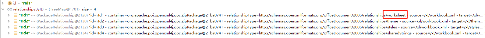
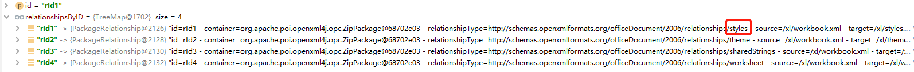

## Logback

```
public void rollover() throws RolloverFailure {

	// when rollover is called the elapsed period's file has
	// been already closed. This is a working assumption of this method.

	String elapsedPeriodsFileName = timeBasedFileNamingAndTriggeringPolicy.getElapsedPeriodsFileName();

	String elapsedPeriodStem = FileFilterUtil.afterLastSlash(elapsedPeriodsFileName);

	if (compressionMode == CompressionMode.NONE) {
		if (getParentsRawFileProperty() != null) {
			renameUtil.rename(getParentsRawFileProperty(), elapsedPeriodsFileName);
		} // else { nothing to do if CompressionMode == NONE and parentsRawFileProperty == null }
	} else {
		if (getParentsRawFileProperty() == null) {
			compressionFuture = compressor.asyncCompress(elapsedPeriodsFileName, elapsedPeriodsFileName, elapsedPeriodStem);
		} else {
			compressionFuture = renameRawAndAsyncCompress(elapsedPeriodsFileName, elapsedPeriodStem);
		}
	}

	if (archiveRemover != null) {
		Date now = new Date(timeBasedFileNamingAndTriggeringPolicy.getCurrentTime());
		this.cleanUpFuture = archiveRemover.cleanAsynchronously(now);
	}
}

public class ArhiveRemoverRunnable implements Runnable {
    Date now;

    ArhiveRemoverRunnable(Date now) {
        this.now = now;
    }

    @Override
    public void run() {
        clean(now);
        if (totalSizeCap != UNBOUNDED_TOTAL_SIZE_CAP && totalSizeCap > 0) {
            capTotalSize(now);
        }
    }
}

public void clean(Date now) {

	long nowInMillis = now.getTime();
	// for a live appender periodsElapsed is expected to be 1
	int periodsElapsed = computeElapsedPeriodsSinceLastClean(nowInMillis);
	lastHeartBeat = nowInMillis;
	if (periodsElapsed > 1) {
		addInfo("Multiple periods, i.e. " + periodsElapsed + " periods, seem to have elapsed. This is expected at application start.");
	}
	for (int i = 0; i < periodsElapsed; i++) {
		int offset = getPeriodOffsetForDeletionTarget() - i;
		Date dateOfPeriodToClean = rc.getEndOfNextNthPeriod(now, offset);
		cleanPeriod(dateOfPeriodToClean);
	}
}
```

## Excel工具类bug

```
public void processOneSheet(String filename,int sheetId,List<JSONObject> resultList) throws Exception {
	OPCPackage pkg = OPCPackage.open(filename);
	XSSFReader r = new XSSFReader(pkg);
	SharedStringsTable sst = r.getSharedStringsTable();
	XMLReader parser = fetchSheetParser(sst);
	// rId2 found by processing the Workbook
	// 根据 rId# 或 rSheet# 查找sheet
	InputStream sheet2 = r.getSheet("rId"+sheetId);
	resultLists = resultList;
	sheetIndex++;
	InputSource sheetSource = new InputSource(sheet2);
	parser.parse(sheetSource);
	sheet2.close();
}
```
- 正常读取


- 异常读取
