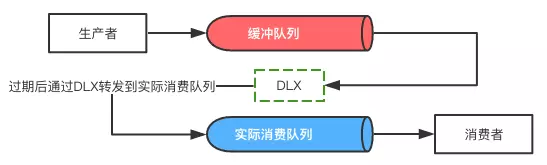
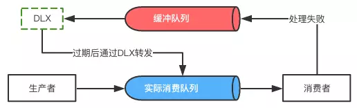

## 基础概念
RabbitMQ整体上是一个生产者与消费者模型，主要负责接收、存储和转发消息。计算机术语：交换机模型。  
在rabbitmq的安装目录下找到sbin目录；打开命令行执行：rabbitmq-plugins enable rabbitmq_management
- connection TCP连接 创建多个 channel 虚拟连接（**线程私有**）
- mandatory=true：如果消息未被路由的情况下，消息会被服务器返回给生产者
- immediate=true：如果该消息关联的队列上有消费者，则立即投递；如果所有匹配队列上没有消费者，则直接将消息返还给生产者，不用将消息存入队列而等待消费者了。3.0版本去掉了这个参数。可以使用TTL=0实现。
- 备份交换器：如果设置的备份交换器不存在或没有绑定任何队列或没有任何匹配的队列，客户端和服务器都不会有异常，此时消息会丢失。如果和mandatory参数一起使用，那么mandatory参数无效。
#### 队列
创建一个已经存在的队列或Exchange，参数和原有的相同是没问题的，但是如果第二次创建的参数和已经存在的不一样，会抛异常。  
如果队列不存在，Consumer 会抛异常。但是Producer 发送的消息会被丢弃。所以为了数据不丢失，Consumer和Producer都应该去创建队列，这样不会出问题。
- durable = false;  持久化 服务器重启后队列还在
- exclusive = true;  独占队列 仅限于此连接 连接关闭自动删除（有消息也会）
- autoDelete = true;  自动删除队列 服务器不再使用是自动删除（消息消费完）
- deliveryMode=2 投递模式 消息会持久化

1. channel.waitForConfirms() 普通发送方确认模式
2. channel.waitForConfirmsOrDie() 批量确认模式
3. channel.addConfirmListener() 异步监听发送方确认模式
#### 路由
Producer 只能发送消息到Exchange，它是不能直接发送到Queue的。如果Exchange不存在，会抛异常  
Producer 发送的消息进入了Exchange。接着通过 RouteKey，RabbitMQ会找到应该把这个消息放到哪个队列里。队列也是通过这个RouteKey来绑定路由。
- autoDelete：设置是否自动删除。自动删除的前提是所有与这个交换器绑定的队列或者交换器与此解绑。
- internal：设置是否内置的。内置的交换器，客户端程序无法直接发送消息到这个交换器中，只能通过交换器路由到交换器这种方式。
1. Direct  
The default exchange is implicitly bound to every queue, with a routing key equal to the queue name.  
It it not possible to explicitly bind to, or unbind from the default exchange. It also cannot be deleted.  
默认的Direct Exchange（名字是空字符）。这个默认的Exchange允许我们发送给指定的队列。RouteKey就是指定的队列名字。
发送到Direct Exchange的消息都会被转发到RouteKey中指定的Queue上。如果不存在RouteKey的绑定，则该消息会被抛弃。
2. Fanout  
任何发送到Fanout Exchange的消息都会被转发到与该Exchange绑定的所有队列上。这种绑定不需要RouteKey。  
这种模式需要提前将Exchange与Queue进行绑定，一个Exchange可以绑定多个队列，一个队列可以同多个Exchange进行绑定。如果接受到消息的Exchange没有与任何Queue绑定，则消息会被抛弃。
3. Topic  
任何发送到Topic Exchange的消息都会被转发到所有关心RouteKey中指定话题的Queue上。这种模式需要RouteKey提前绑定Exchange与队列。  
\* (星号) 代表任意 一个单词；# (hash) 0个或者多个单词。如果Exchange没有发现能够与RouteKey匹配的队列，则会抛弃此消息。
> 性能排序：fanout > direct > topic 比例大约为11：10：6
#### 消费者
1. 推模式：消息中间件主动将消息推送给消费者 channel.basicConsume
2. 拉模式：消费者主动从消息中间件拉取消息 channel.basicGet

对于多个Consumer来说，RabbitMQ 使用循环的方式（round-robin）的方式均衡的发送给不同的Consumer。  
默认状态下，RabbitMQ将第n个Message分发给第n个Consumer。当然n是取余后的。它不管Consumer是否还有unacked Message，只是按照这个默认机制进行分发。  
channel.basicQos(1) 设置客户端能保持最大消息未确认的个数;这样RabbitMQ就会使得每个Consumer在同一个时间点最多处理一个Message。换句话说，在接收到该Consumer的ack前，他它不会将新的Message分发给它。  
这种方法可能会导致queue满。这种情况下你可能需要添加更多的Consumer，或者创建更多的virtualHost来细化。

如果服务器一直没有收到消费者的确认信号，并且消费此消息的消费者已经断开连接，则RabbitMQ会安排该消息重新进入队列，等待投递给下一个消费者，当然可能还是原来的那个消费者。不会为未确认的消息设置过期时间，唯一依据是消费者是否断开连接。
- noLocal：不能将同一个连接生产者发送的消息传递给同一个连接的消费者。
#### 方法
- basicAck 方法的第二个参数 multiple 取值为 false 时，表示通知 RabbitMQ 当前消息被确认；如果为 true，则额外将比第一个参数指定的 deliveryTag 小的消息一并确认。
- basicReject 和 basicNack 拒绝消息
- basicRecover 方法请求服务器重新发送还未被确认的消息。requeue=true 可能分配给与之前不同的消费者 false 分配给与之前相同的消费者。

## 高级特性
#### TTL(Time-To-Live)
第一种方法通过队列设置，队列中所有消息都有相同的过期时间。一但消息过期，就会从队列中抹去。第二种是对消息本身单独设置，每条消息的TTL可以不同。即使消息过期，也不会马上从队列中抹去，因为每条消息是否过期是在即将投递到消费者之前判定的。两种同时设置以较小的数值为准。  
因为第一种方法里队列中已过期的消息肯定在队列头部，只要定期从对头开始扫描即可。第二种方法每条消息的过期时间不同，如果要删除所有过期消息势必要扫描整个队列，所以不如等到此消息即将被消费时再判定是否过期，如果过期再进行删除。
#### 死信(Dead Letter Exchange)
1. 消息被拒绝（Basic.Reject/Basic.Nack）且requeue=false
2. 消息过期
3. 队列达到最大长度
#### 延迟消费

#### 延迟重试

由于队列的先进先出特性，只有当过期的消息到了队列的顶端（队首），才会被真正的丢弃或者进入死信队列。所以在考虑使用RabbitMQ来实现延迟任务队列的时候，需要确保业务上每个任务的延迟时间是一致的。如果遇到不同的任务类型需要不同的延时的话，需要为每一种不同延迟时间的消息建立单独的消息队列。

## 部署
#### 集群
RabbitMQ集群允许消费者和生产者在单个节点崩溃的情况下继续运行，它可以通过添加更多的节点来线性地扩展消息通信地吞吐量。当失去一个节点时，客户端能够重新连接到集群中的任何节点并继续生产或者消费。不过集群不能保证消息的万无一失，当一个节点崩溃时，该节点上的所有队列中的消息也会丢失。所有节点会备份元数据信息，但是不会备份消息。  
基于存储空间和性能的考虑，在集群中创建队列，集群只会在单个节点而不是所有节点上创建队列的进程并包含完整的队列信息。只有队列的宿主节点知道队列的所有信息，所有其他非所有者节点只知道队列的元数据（名称和属性）和指向该队列存在的那个节点指针。因此当集群节点崩溃时，该节点的队列进程和关联的绑定都会消失。附加在那些队列上的消费者也会丢失其所订阅的的信息，并且任何匹配该队列绑定的新消息也都会消失。

如果关闭了集群中所有的节点，则需要确保在启动的时候最后关闭的那个节点是第一个启动的。如果第一个启动的不是最后关闭的节点，那么这个节点会等待最后关闭的节点启动。如果没有等到，那么这个先启动的节点也会失败。也可以将此节点剔出集群。  
单节点集群必然只有磁盘类型的节点。多节点可以选择配置部分节点为内存节点，提高性能。但是至少有一个磁盘节点。如果集群中唯一的磁盘节点崩溃，集群仍然可以保持运行，但是直到将该节点恢复到集群前，你无法更改任何东西。所以在建立集群的时候应该保证两个或者多个磁盘节点。
#### 联邦
默认的交换器""不能使用联邦功能。
联邦队列不具有传递性。

## 持久化
不管是持久化的消息还是非持久化的消息都可以被写入到磁盘。持久化的消息在到达队列时就被写入到磁盘，并且如果可以，持久化的消息也会在内存中保存一份备份，这样可以提高一定的性能，当内存吃紧的时候会从内存中清除。非持久化的消息一般只保存在内存中，在内存吃紧的时候会被换入到磁盘中，以节省内存空间。
#### 惰性队列
惰性队列会尽可能地将消息存入磁盘中，而在消费者消费到相应的消息时才会被加载到内存中，它的一个重要设计目标是能够支持更长的队列，即更多的消息存储。
