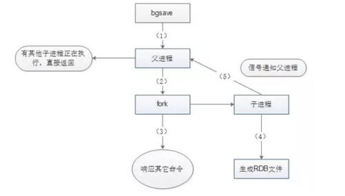
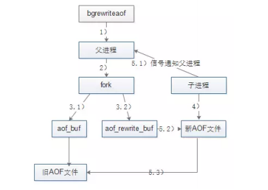

## 介绍
REmote DIctionary Server 基于内存的数据库(Key-Value)，并且提供一定的持久化功能。性能十分优越，可以支持每秒十几万次的读/写操作，其性能远超数据库，并且还支持集群、分布式、主从同步等配置，原则上可以无限扩展，让更多的数据存储在内存中，更让人欣慰的是它还支持一定的事务能力，这保证了高并发的场景下数据的安全和一致性。
1. 业务数据常用吗？命中率如何？如果命中率很低，就没有必要写入缓存；
2. 该业务数据是读操作多，还是写操作多？如果写操作多，频繁需要写入数据库，也没有必要使用缓存；
3. 业务数据大小如何？如果要存储几百兆字节的文件，会给缓存带来很大的压力，这样也没有必要；
#### 特点
1. Redis支持数据的持久化，可以将内存中的数据保存在磁盘中，重启的时候可以再次加载进行使用。
2. Redis不仅仅支持简单的key-value类型的数据，同时还提供list，set，zset，hash等数据结构的存储。
3. Redis支持数据的备份，即master-slave模式的数据备份。
#### 优势
1. 性能极高 – Redis能读的速度是110000次/s,写的速度是81000次/s 。
2. 丰富的数据类型 – Redis支持二进制案例的 Strings, Lists, Hashes, Sets 及 Ordered Sets 数据类型操作。
3. 原子 – Redis的所有操作都是原子性的，意思就是要么成功执行要么失败完全不执行。单个操作是原子性的。多个操作也支持事务，即原子性，通过MULTI和EXEC指令包起来。
4. 丰富的特性 – Redis还支持 publish/subscribe, 通知, key 过期等等特性。
#### Redis常见性能问题和解决方案
1. Master最好不要做任何持久化工作，如RDB内存快照和AOF日志文件
2. 如果数据比较重要，某个Slave开启AOF备份数据，策略设置为每秒同步一次
3. 为了主从复制的速度和连接的稳定性，Master和Slave最好在同一个局域网内
4. 尽量避免在压力很大的主库上增加从库
5. 主从复制不要用图状结构，用单向链表结构更为稳定，即：Master <- Slave1 <- Slave2 <- Slave3
#### 五种基本数据类型
1. **string**（字符串）
    1. string 是 redis 最基本的类型，你可以理解成与 Memcached 一模一样的类型，一个 key 对应一个 value。
    2. string 类型是二进制安全的。意思是 redis 的 string 可以包含任何数据。比如jpg图片或者序列化的对象。
    3. string 类型是 Redis 最基本的数据类型，string 类型的值最大能存储 512MB。
2. **hash**（哈希）
    1. Redis hash 是一个键值(key=>value)对集合。
    2. Redis hash 是一个 string 类型的 field 和 value 的映射表，hash 特别适合用于存储对象。每个 hash 可以存储2^32 -1 键值对（40多亿）。
3. **list**（列表）
    1. Redis 列表是简单的字符串列表，按照插入顺序排序。你可以添加一个元素到列表的头部（左边）或者尾部（右边）。
4. **set**（集合）
    1. Redis的Set是string类型的无序集合。集合是通过哈希表实现的，所以添加，删除，查找的复杂度都是O(1)。
5 **zset**(sorted set：有序集合)
    1. Redis zset 和 set 一样也是string类型元素的集合,且不允许重复的成员。不同的是每个元素都会关联一个double类型的分数。redis正是通过分数来为集合中的成员进行从小到大的排序。
    2. zset的成员是唯一的,但分数(score)却可以重复。

## Redis高性能
#### 内存访问
Redis将所有数据放在内存中，内存的响应时间大约为100纳秒，这时Redis达到每秒万级别访问的重要基础。
#### 单线程
避免了线程切换和竞态产生的消耗。
Redis的单线程指的是网络请求模块使用了一个线程（所以不需考虑并发安全性），即一个线程处理所有网络请求，其他模块仍用了多个线程。  
Redis利用队列技术将并发访问变为串行访问，消除了传统数据库串行控制的开销。
#### 非阻塞I/O
Redis使用epoll作为I/O多路复用技术的实现，在加上Redis自身的事件处理模型将epoll中的链接、读写、关闭都转换为事件，不在网络I/O上浪费过多的时间；
#### 数据结构
Redis全程使用hash结构，读取速度快，还有一些特殊的数据结构，对数据存储进行了优化，如压缩表，对短数据进行压缩存储，再如，跳表，使用有序的数据结构加快读取的速度。
还有一点，Redis采用自己实现的事件分离器，效率比较高，内部采用非阻塞的执行方式，吞吐能力比较大。

## Redis清除策略
#### 被动删除
当读/写一个已经过期的key时，会触发惰性删除策略，直接删除掉这个过期key。
#### 主动删除
由于惰性删除策略无法保证冷数据被及时删掉，所以Redis会定期主动淘汰一批已过期的key。
当前已用内存超过maxmemory限定时，触发主动清理策略。
#### Redis的回收策略
1. volatile-lru：从已设置过期时间的数据集（server.db[i].expires）中挑选最近最少使用的数据淘汰
2. volatile-ttl：从已设置过期时间的数据集（server.db[i].expires）中挑选将要过期的数据淘汰
3. volatile-random：从已设置过期时间的数据集（server.db[i].expires）中任意选择数据淘汰
4. allkeys-lru：从数据集（server.db[i].dict）中挑选最近最少使用的数据淘汰
5. allkeys-random：从数据集（server.db[i].dict）中任意选择数据淘汰
6. no-enviction（驱逐）：禁止驱逐数据

## Redis持久化
持久化是最简单的高可用方法（有时甚至不归为高可用的手段），主要作用是数据备份，即将数据存储在硬盘，保证数据不会因进程退出而丢失。
#### RDB
将当前数据生成快照保存到硬盘，默认方式。RDB文件是经过压缩的二进制文件。压缩不是针对整个文件，而是对数据库中的字符串达到一定长度（20字节）时才会进行。
1. 手动触发
    1. save命令会阻塞Redis服务器进程，直到RDB文件创建完毕，基本被废弃。
    2. bgsave命令会创建一个子进程去创建RDB文件，主进程继续处理请求。只有fork子进程时会阻塞服务器。
2. 自动触发: save m n 当m秒发生n次变化时，会触发bgsave。900 1 | 300 10 | 60 10000
    1. serverCron是Redis服务器的周期性操作函数，默认每隔100ms执行一次；该函数对服务器的状态进行维护。
    2. dirty计数器是Redis服务器维护的一个状态，记录了上一次bgsave/save命令后，服务器进行了多少次增删改；而当bgsave/save执行完成后，归0。  
    set mykey hello +1 | sadd myset v1 v2 v3 +3
    3. lastsave时间戳也是Redis服务器维持的一个状态，记录的是上一次成功执行bgsave/save的时间。

    每隔100ms执行serverCron函数，遍历save m n配置的条件，只要有一个条件满足，就进行bgsave。对于每一个条件要满足 当前时间-lastsave > m 和 dirty >= n

> 主从复制场景，从节点执行全量复制操作，则主节点会执行bgsave，并将rdb文件发送给从节点。执行shutdown命令会自动执行rdb持久化。

- bgsave 执行流程

1. Redis父进程首先判断当前是否在执行save/bgsave/bgrewriteaof的子进程，如果在执行则bgsave命令直接返回。  
bgsave/bgrewriteaof子进程不能同时执行，主要是性能方面考虑：两个并发的子进程同时执行大量的磁盘写操作，可能引起严重的性能问题。
2. 父进程执行fork操作创建子进程，这个过程中父进程是阻塞的，Redis不能执行来自客户端的任何命令。
3. 父进程fork后，bgsave命令返回Background saving started信息并不再阻塞父进程，并可以相应其他命令。
4. 子进程创建rdb文件，根据父进程内存快照生成临时快照文件，完成后对原有文件进行原子替换。
5. 子进程发送信号给父进程表示完成，父进程更新统计信息。
- 启动时加载
RDB文件的载入工作是在服务器启动时自动执行的，没有专门的命令。AOF开启时，会优先载入AOF文件来恢复数据；AOF关闭时才会在服务器启动时检测RDB文件并自动载入。  
服务器载入期间处于阻塞状态，直到载入完成为止。如果文件损坏，日志中打印错误，Redis启动失败。
#### AOF
将每次执行写命令保存到硬盘（类似MySQL的binlog）。实时性更好；主流的持久化方案。Redis服务器默认开启RDB，关闭AOF；打开配置 appendonly yes  
AOF记录每条写命令，因此不需要触发；执行流程如下
1. 命令追加：将Redis的写命令追加到缓冲区aof_buf。直接写入文件，硬盘IO是负载瓶颈。
2. 文件写入和文件同步：根据不同的同步策略将aof_buf中的内容同步到硬盘。appendfsync
    1. always：命令写入aof_buf后立即调用系统fsync操作同步到AOF文件，fsync完成后线程返回。每次写命令都要同步，硬盘IO是性能瓶颈。
    2. no: 命令写入aof_buf后调用系统write操作，不对AOF文件做fsync同步；同步由操作系统负责，通常同步周期为30秒。
    文件同步时间不可控，且缓冲区中堆积的数据会很多，数据安全性无法保证。
    3. everysec: 命令写入后aof_buf后调用系统write操作，write完成后线程返回。fsync同步文件操作由专门的线程每秒调用一次。性能和数据安全的平衡；默认配置。
3. 文件重写：定期重写AOF文件，达到压缩的目的。把进程内的数据转化为写命令同步到新的AOF文件。文件重写不是必须的。
    1. 过期的数据不再写入文件
    2. 无效的命令不再写入文件：重复设值、删除了的数据
    3. 多条命令可以合并为一个。为了防止单条命令过大造成客户端缓冲区溢出，对于list、set、hash、zset类型的key，  
    并不一定只使用一条命令；而是常量 REDIS_AOF_REWRITE_ITEMS_PER_CMD 为界将命令拆分多条。
    - 手动触发：直接调用bgrewriteaof命令，该命令的执行与bgsave有些类似；都是fork子进程进行具体的工作，在fork时阻塞。
    - 自动触发：两个条件同时满足时会触发bgrewriteaof命令
        1. auto-aof-rewrite-min-size：执行AOF重写时，文件的最小体积，默认64MB。
        2. auto-aof-rewrite-percentage: 执行AOF重写时，当前AOF大小（aof_current_size）和上一次重写时AOF大小（aof_base_size）的比值。
- bgrewriteaof 执行流程 重写由父进程fork子进程进行；重写期间执行的写命令需要追加到新的AOF文件中，引入了aof_rewrite_buf缓存。

1. 父进程首先判断是否正在执行bgsave/bgrewriteaof的子进程，如果存在bgrewriteaof则直接返回，存在bgsave命令则等bgsave执行完成后再执行。
2. 父进程执行fork操作创建子进程，这个过程父进程是阻塞的。
3. 
    1. 父进程fork后，bgrewriteaof命令返回 Background append only file rewrite started 信息并不再阻塞父进程，响应其他命令。Redis的所有写命令依然写入AOF缓存区，并根据appendfsync策略同步到硬盘保证原有AOF机制的正确。
    2. fork操作使用写时复制技术，子进程只能共享fork操作操作时的内存数据。由于父进程依然在响应命令，因此Redis使用AOF重写缓存区（aof_rewrite_buf）保存这部分数据，防止新AOF文件生成期间丢失这部分数据。bgrewriteaof执行期间，Redis的写命令同时追加到aof_buf和aof_rewirte_buf两个缓冲区。
4. 子进程根据内存快照，按照命令合并规则写入到新的AOF文件。
5. 
    1. 子进程写完新的AOF文件后，向父进程发信号，父进程更新统计信息。
    2. 父进程把AOF文件重写缓冲区的数据写入到新的AOF文件，保证了新AOF文件所保存的数据库状态和服务器当前状态一致。
    3. 使用新的AOF文件替换老文件，完成AOF重写。
- 启动时加载：当AOF开启，但AOF文件不存在时，即使RDB文件存在也不会加载。  
aof-load-truncated 默认开启，AOF文件结尾不完整，日志警告，忽略掉文件的尾部，服务器启动成功。  
因为Redis的命令只能在客户端上下文中执行，载入AOF文件之前，服务器会创建一个没有网路连接的客户端，执行AOF文件命令。

| 配置 | 默认值 | 说明
|---|---|---|
| save m n | 900 1 / 300 10 / 60 10000 | bgsave自动触发条件；如果没有save m n配置，相当于自动的RDB持久化关闭
| stop-writes-on-bgsave-error | yes | 当bgsave出现错误时，Redis是否停止执行写命令
| rdbcompression | yes | 是否开启RDB文件压缩
| rebchecksum | yes | 是否开启RDB文件验证；关闭大文件可以提升10%性能
| dbfilename | dump.rdb | RDB文件名
| dir | ./ | RDB文件和AOF文件所在目录
| appendonly | no | 是否开启AOF
| appendfilename | appendonly.aof | AOF文件名
| appendfsync | everysec | fsync持久化策略
| no-appendfsync-on-rewrite | no | AOF重写期间是否禁止fsync
| auto-aof-rewrite-percentage | 100 | 文件重写触发条件之一
| auto-aof-rewrite-min-size | 64MB | 文件重写触发条件之一
| aof-load-truncated | yes | AOF文件结尾损坏，Redistribution启动时是否仍载入AOF文件

RDB方式的优点是文件紧凑，体积小，网络传输快，适合全量复制；恢复速度比AOF快很多。对性能的影响相对较小。缺点是数据快照的持久化方式做不到实时，兼容性差。  
AOF方式的优点是在于支持秒级持久化、兼容性好。缺点是文件大、恢复速度慢，对性能影响大。  
在统一Redis实例中同时开启AOF和RDB方式的数据持久化方案也是可以的。重启时AOF文件将用于重建原始数据，因为AOF方式能最大限度保证数据的完整性。

## Redis部署
#### 复制
复制是Redis高可用的基础，哨兵和集群都是在复制基础上实现高可用的。复制主要实现了数据的多机备份，以及对于读操作的负载均衡和简单的故障恢复。  
缺点：故障恢复无法自动化；写操作无法负载均衡，存储能力收到单机的限制。
#### 哨兵
在复制的基础上，哨兵实现了自动化的故障恢复。  
缺点：写操作无法负载均衡，存储能力受到单机的限制。
#### 集群
通过集群，Redis解决了写操作无法负债均衡，以及存储能力收到单机限制的问题，实现了较为完善的高可用方案。