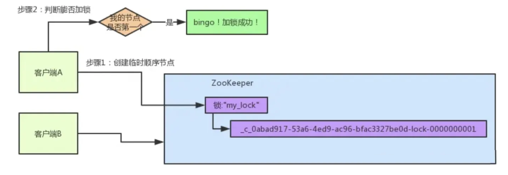
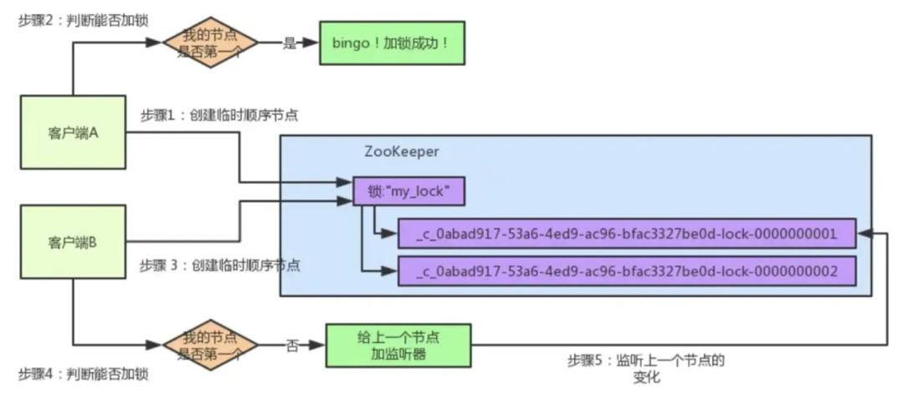
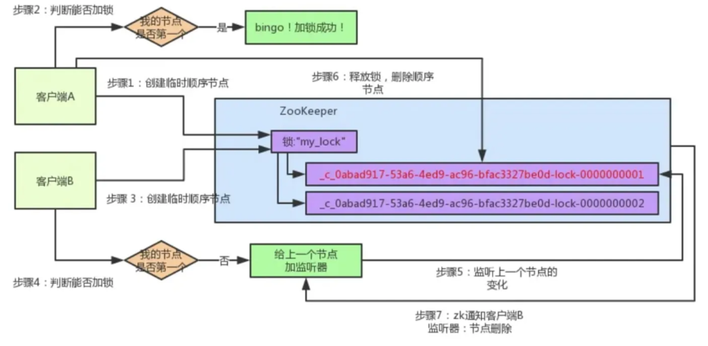
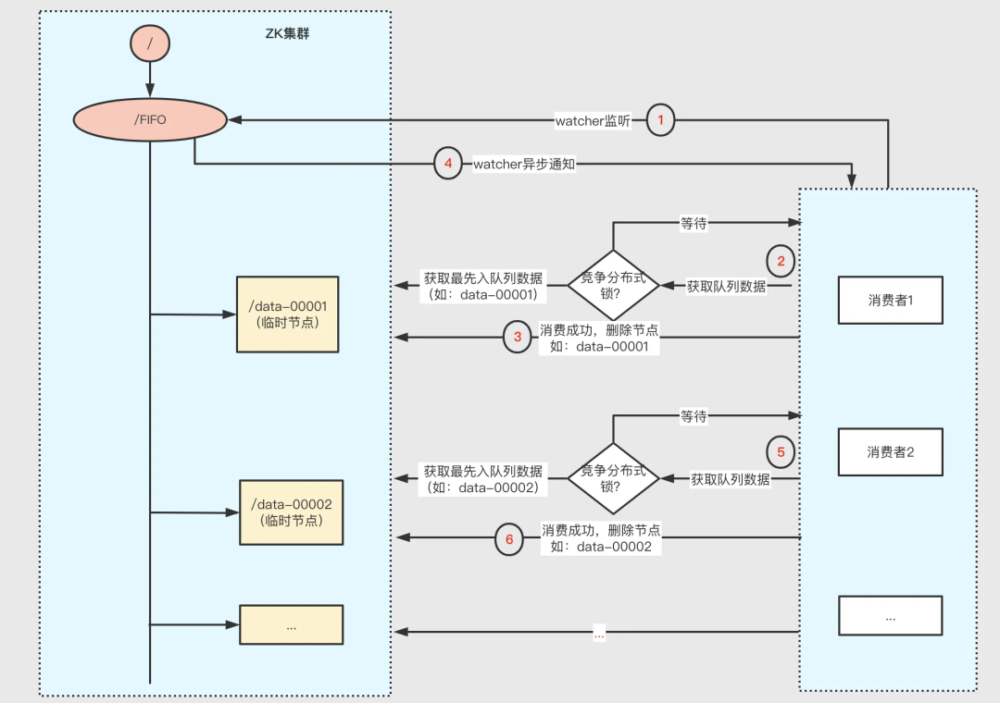

## 核心知识

为了应对大流量，现代应用/中间件通常采用分布式部署，此时不得不考虑 CAP 问题。ZooKeeper（后文简称 ZK）是面向 CP 设计的一个开源的分布式协调框架，将那些复杂且容易出错的分布式一致性服务封装起来，构成一个高效可靠的原语集，并以一系列简单易用的接口提供给用户使用，分布式应用程序可以基于它实现诸如数据发布/订阅、负载均衡、命名服务、集群管理、Master 选举、分布式锁、分布式队列等功能。

### 数据结构

#### ZNode

ZK 在**内存**中维护了一个**类似文件系统的树状数据结构**实现命名空间（如下），树中的节点称为 **znode**。


znode 要比文件系统的路径复杂，既可以通过路径访问，又可以存储数据。znode 具有四个属性 data、acl、stat、children

- **data：**znode 相关的业务数据均存储在这里，但是，**父节点不可存储数据；**
- **children：**存储当前节点的子节点引用信息，因为内存限制，所以 **znode 的子节点数不是无限的；**
- **stat：**包含 znode 节点的状态信息，比如: 事务 id、版本号、时间戳等，**其中事务 id 和 ZK 的数据一直性、选主相关；**
- **acl：**记录客户端对 znode 节点的访问权限；

**注意：**znode 的**数据操作具有原子性**，读操作将获取与节点相关的所有数据，写操作也将替换掉节点的所有数据。**znode 可存储的最大数据量是 1MB** ，但实际上我们在 znode 的数据量应该尽可能小，因为数据过大会导致zk的性能明显下降。**每个 ZNode 都对应一个唯一的路径。**

#### 事物 ID

Zxid 由 Leader 节点生成。当有新写入事件时，Leader 节点生成新的 Zxid，并随提案一起广播。Zxid 的生成规则如下：


- **epoch：**任期/纪元，Zxid 的高32位， ZAB 协议通过 epoch 编号来区分Leader 周期变化，每次一个 leader 被选出来，它都会有一个新的 epoch=（原来的 epoch+1），标识当前属于那个leader的 统治时期；可以假设 leader 就像皇帝，epoch 则相当于年号，每个皇帝都有自己的年号；
- **事务计数器：**Zxid 的低32位，每次数据变更，计数器都会加一；

zxid 是递增的，所以谁的 zxid 越大，就表示谁的数据是最新的。每个节点都保存了当前最近一次事务的 Zxid。**Zxid 对于 ZK 的数据一致性以及选主都有着重要意义**，后边在介绍相关知识时会重点讲解其作用原理。

####  ZNode 类型

节点根据**生命周期**的不同可以将划分为**持久节点**和**临时节点**。持久节点的存活时间不依赖于客户端会话，只有客户端在显式执行删除节点操作时，节点才消失；临时节点的存活时间依赖于客户端会话，当会话结束，临时节点将会被自动删除（当然也可以手动删除临时节点）。**注意：临时节点不能拥有子节点。**

**节点类型是在创建时进行制定，后续不能改变。**如 create /n1 node1 创建了一个数据为”node1”的持久节点/n1；在上述指令基础上加上参数-e：create -e /n1/n3 node3，则创建了一个数据为”node3”的临时节点 /n1/n3。

**create 命令还有一个可选参数**-s **用于指定创建的节点是否具有顺序特性****。**创建顺序节点时，zk 会在路径后面自动追加一个 **递增的序列号**，这个序列号可以保证在**同一个父节点下是唯一的**，利用该特性我们可以实现**分布式锁** 等功能。

基于znode的上述两组特性，两两组合后可构建4种类型的节点：

- **PERSISTENT：永久节点**
- **EPHEMERAL：临时节点**
- **PERSISTENT_SEQUENTIAL：永久顺序节点**
- **EPHEMERAL_SEQUENTIAL：临时顺序节点**

### Watcher 监听

Watcher 监听机制是ZK非常重要的一个特性。ZK 允许 Client 端在指定节点上注册 Watcher，监听节点数据变更、节点删除、子节点状态变更等事件，当特定事件发生时，ZK 服务端会异步通知注册了相应 Watcher 的客户端，通过该机制，我们可以利用 ZK 实现数据的发布和订阅等功能。

Watcher 监听机制由三部分协作完成：ZK 服务端、ZK 客户端、客户端的 WatchManager 对象。工作时，客户端首先将 Watcher 注册到服务端，同时将 Watcher 对象保存到客户端的 Watch 管理器中。当 ZK 服务端监听的数据状态发生变化时，服务端会主动通知客户端，接着客户端的 Watch 管理器会触发相关 Watcher 来回调相应处理逻辑。


注意：

- **watcher 变更通知是一次性的：**当数据发生变化的时候， ZK 会产生一个 watcher 事件，并且会发送到客户端。但是客户端只会收到一次通知。如果后续这个节点再次发生变化，那么之前设置 Watcher 的客户端不会再次收到消息。可以通过循环监听去达到永久监听效果。
- **客户端 watcher 顺序回调：**watcher 回调是顺序串行化执行的，只有回调后客户端才能看到节点最新的状态。watcher 回调逻辑不应太复杂，否则可能影响 watcher 执行。
- **不会告诉节点变化前后的具体内容：**watchEvent 是最小的通信单元，结构上包含通知状态、事件类型和节点路径，但是，不会告诉节点变化前后的具体内容。
- **时效性：**watcher 只有在当前 session 彻底失效时才会无效，若在 session 有效期内快速重连成功，则 watcher 依然存在，仍可收到事件通知。

### ZK 集群

为了确保服务的高可用性，ZK 采用集群化部署，如下：


ZK 集群服务器有三种角色：Leader、Follower 和 Observer

- **Leader：**一个 ZK 集群同一时间只会有一个实际工作的 Leader，它会发起并维护与各 Follwer 及 Observer 间的心跳。所有的写操作必须要通过 Leader 完成再由 Leader 将写操作广播给其它服务器。
- **Follower：**一个 ZK 集群可同时存在多个 Follower，它会响应 Leader 的心跳。Follower 可直接处理并返回客户端的读请求，同时会将写请求转发给 Leader 处理，参与事务请求 Proposal 的投票及 Leader 选举投票。
- **Observer：**Observer 是3.3.0 版本开始引入的一个服务器角色，一个 ZK 集群可同时存在多个 Observer， 功能与 Follower 类似，但是，不参与投票。

> 早期的 ZooKeeper 集群服务运行过程中，只有 Leader 服务器和 Follow 服务器。随着集群规模扩大，follower 变多，ZK 在创建节点和选主等事务性请求时，需要一半以上节点 AC，所以导致性能下降写入操作越来越耗时，follower 之间通信越来越耗时。为了解决这个问题，就引入了观察者，可以处理读，但是不参与投票。既保证了集群的扩展性，又避免过多服务器参与投票导致的集群处理请求能力下降。


ZK 集群中通常有很多服务器，那么如何区分不同的服务器的角色呢？可以通过服务器的状态进行区分

- LOOKING：寻找 Leader 状态。当服务器处于该状态时，它会认为当前集群中没有 Leader，因此需要进入 Leader 选举状态。
- LEADING：领导者状态。表明当前服务器角色是 Leader。
- FOLLOWING：跟随者状态，同步 leader 状态，参与投票。表明当前服务器角色是 Follower。
- OBSERVING：观察者状态，同步 leader 状态，不参与投票。表明当前服务器角色是 Observer。

ZK 集群是一主多从的结构，所有的所有的写操作必须要通过 Leader 完成，Follower 可直接处理并返回客户端的读请求。那么如何保证从 Follower 服务器读取的数据与 Leader 写入的数据的一致性呢？Leader 万一由于某些原因崩溃了，如何选出新的 Leader，如何保证数据恢复？Leader 是怎么选出来的？


### ZAB 协议

ZK 专门设计了 ZAB 协议(Zookeeper Atomic Broadcast)来保证主从节点数据的一致性。下面分别从 client 向 Leader 和 Follower 写数据场景展开陈述。

#### 写 Leader 场景数据一致性


1. 客户端向 Leader 发起写请求。
2. Leader 将写请求以 Proposal 的形式发给所有 Follower 并等待 ACK。
3. Follower 收到 Leader 的 Proposal 后返回 ACK。
4. Leader 得到过半数的 ACK（Leader 对自己默认有一个 ACK）后向所有的 Follower 和 Observer 发送 Commmit。
5. Leader 将处理结果返回给客户端。

**注意：**

- Leader 不需要得到所有 Follower 的 ACK，只要收到过半的 ACK 即可，同时Leader 本身对自己有一个ACK。上图中有2个 Follower，只需其中两个返回ACK即可，因为(1+1) / (2+1) > 1/2。
- Observer 虽然无投票权，但仍须同步 Leader 的数据从而在处理读请求时可以返回尽可能新的数据。

#### 写 Follower 场景数据一致性


1. 客户端向 Follower 发起写请求， Follower 将写请求转发给 Leader 处理；
2. 其它流程与直接写 Leader 无任何区别。

**注意：**Observer 与 Follower 写流程相同。

#### 最终一致性

Zab 协议消息广播使用两阶段提交的方式，达到主从数据的最终一致性。为什么是最终一致性呢？从上文可知数据写入过程核心分成下面两阶段：

1. 第一阶段：Leader数据写入事件作为提案广播给所有 Follower 结点；可以写入的Follower结点返回确认信息 ACK。
2. 第二阶段：Leader 收到一半以上的 ACK 信息后确认写入可以生效，向所有结点广播 COMMIT 将提案生效。

根据写入过程的两阶段的描述，可以知道 ZooKeeper 保证的是最终一致性，即 Leader 向客户端返回写入成功后，可能有部分 Follower 还没有写入最新的数据，所以是最终一致性。ZooKeeper 保证的最终一致性也叫顺序一致性，即每个结点的数据都是严格按事务的发起顺序生效的。ZooKeeper 集群的写入是由 Leader 结点协调的，真实场景下写入会有一定的并发量，那 Zab 协议的两阶段提交是如何保证事务严格按顺序生效的呢？ZK 事物的顺序性是借助上文中的Zxid实现的。Leader 在收到半数以上 ACK 后会将提案生效并广播给所有 Follower 结点，Leader 为了保证提案按 ZXID 顺序生效，使用了一个 ConcurrentHashMap，记录所有未提交的提案，命名为 outstandingProposals，key 为 ZXID，Value 为提案的信息。对 outstandingProposals 的访问逻辑如下：

1. Leader 每发起一个提案，会将提案的 ZXID 和内容放到 outstandingProposals 中，作为待提交的提案；
2. Leader收到 Follower 的 ACK 信息后，根据 ACK 中的 ZXID 从 outstandingProposals 中找到对应的提案，对 ACK 计数;
3. 执行 tryToCommit 尝试将提案提交：判断流程是，先判断当前 ZXID 之前是否还有未提交提案，如果有，当前提案暂时不能提交；再判断提案是否收到半数以上 ACK，如果达到半数则可以提交；如果可以提交，将当前 ZXID 从 outstandingProposals 中清除并向 Followers 广播提交当前提案；

Leader 是如何判断当前 ZXID 之前是否还有未提交提案的呢？由于前提是保证顺序提交的，所以 Leader 只需判断 outstandingProposals 里，当前 ZXID 的前一个 ZXID 是否存在。代码如下：


所以 ZooKeeper 是通过两阶段提交保证数据的最终一致性，并且通过严格按照 ZXID 的顺序生效提案保证其顺序一致性的。

### 选主原理

ZK中默认的并建议使用的 Leader 选举算法是：基于 TCP 的 FastLeaderElection。在分析选举原理前，先介绍几个重要的参数。

- 服务器 ID(myid)：每个 ZooKeeper 服务器，都需要在数据文件夹下创建一个名为 myid 的文件，该文件包含整个 ZooKeeper 集群唯一的 ID（整数）。该参数在选举时如果无法通过其他判断条件选择 Leader，那么将该 ID 的大小来确定优先级。
- 事务 ID(zxid)：单调递增，值越大说明数据越新，权重越大。
- 逻辑时钟(epoch-logicalclock)：同一轮投票过程中的逻辑时钟值是相同的，每投完一次值会增加。
- ZK 的 leader 选举存在两类，一个是服务器启动时 leader 选举，另一个是运行过程中服务器宕机时的 leader 选举，下面依次展开介绍。

#### 服务器启动时的 leader 选举

**1、各自推选自己：**ZooKeeper 集群刚启动时，所有服务器的 logicClock 都为 1，zxid 都为 0。各服务器初始化后，先把第一票投给自己并将它存入自己的票箱，同时广播给其他服务器。此时各自的票箱中只有自己投给自己的一票，如下图所示：


**2、更新选票：**第一步中各个服务器先投票给自己，并把投给自己的结果广播给集群中的其他服务器，这一步其他服务器接收到广播后开始更新选票操作，以 Server1 为例流程如下：

1. 1. Server1 收到 Server2 和 Server3 的广播选票后，由于 logicClock 和 zxid 都相等，此时就比较 myid；
   2. Server1 收到的两张选票中 Server3 的 myid 最大，此时 Server1 判断应该遵从 Server3 的投票决定，将自己的票改投给 Server3。接下来 Server1 先清空自己的票箱(票箱中有第一步中投给自己的选票)，然后将自己的新投票(1->3)和接收到的 Server3 的(3->3)投票一起存入自己的票箱，再把自己的新投票决定(1->3)广播出去,此时 Server1 的票箱中有两票：(1->3),(3->3)；
   3. 同理，Server2 收到 Server3 的选票后也将自己的选票更新为（2->3）并存入票箱然后广播。此时 Server2 票箱内的选票为(2->3)，(3->3)；
   4. Server3 根据上述规则，无须更新选票，自身的票箱内选票仍为（3->3）；
   5. Server1 与 Server2 重新投给 Server3 的选票广播出去后，由于三个服务器最新选票都相同，最后三者的票箱内都包含三张投给服务器 3 的选票。


**3、根据选票确定角色：**根据上述选票，三个服务器一致认为此时 Server3 应该是 Leader。因此 Server1 和 Server2 都进入 FOLLOWING 状态，而 Server3 进入 LEADING 状态。之后 Leader 发起并维护与 Follower 间的心跳。


#### 运行时 Follower 重启选举

本节讨论 Follower 节点发生故障重启或网络产生分区恢复后如何进行选举。

**1、Follower 重启投票给自己：**Follower 重启，或者发生网络分区后找不到 Leader，会进入 LOOKING 状态并发起新的一轮投票。


**2、发现已有 Leader 后成为 Follower：**Server3 收到 Server1 的投票后，将自己的状态 LEADING 以及选票返回给 Server1。Server2 收到 Server1 的投票后，将自己的状态 FOLLOWING 及选票返回给 Server1。此时 Server1 知道 Server3 是 Leader，并且通过 Server2 与 Server3 的选票可以确定 Server3 确实得到了超过半数的选票。因此服务器 1 进入 FOLLOWING 状态。


#### 运行时 Leader 重启选举

**1、Follower 发起新投票：**Leader（Server3）宕机后，Follower（Server1 和 2）发现 Leader 不工作了，因此进入 LOOKING 状态并发起新的一轮投票，并且都将票投给自己，同时将投票结果广播给对方。


**2、更新选票：**（1）Server1 和 2 根据外部投票确定是否要更新自身的选票，这里跟之前的选票 PK 流程一样，比较的优先级为：logicLock > zxid > myid，这里 Server1 的参数(L=3, M=1, Z=11)和 Server2 的参数(L=3, M=2, Z=10)，logicLock 相等，zxid 服务器 1 大于服务器 2，因此服务器 2 就清空已有票箱，将(1->1)和(2->1)两票存入票箱，同时将自己的新投票广播出去 （2）服务器 1 收到 2 的投票后，也将自己的票箱更新。


**3、重新选出 Leader：**此时由于只剩两台服务器，服务器 1 投票给自己，服务器 2 投票给 1，所以 1 当选为新 Leader。


**4、旧 Leader 恢复发起选举：**之前宕机的旧 Leader 恢复正常后，进入 LOOKING 状态并发起新一轮领导选举，并将选票投给自己。此时服务器 1 会将自己的 LEADING 状态及选票返回给服务器 3，而服务器 2 将自己的 FOLLOWING 状态及选票返回给服务器 3。


**5、旧 Leader 成为 Follower：**服务器 3 了解到 Leader 为服务器 1，且根据选票了解到服务器 1 确实得到过半服务器的选票，因此自己进入 FOLLOWING 状态。


#### 脑裂

对于一主多从类的集群应用，通常要考虑脑裂问题，脑裂会导致数据不一致。那么，什么是脑裂？简单点来说，就是一个集群有两个 master。通常脑裂产生原因如下：

1. 假死：由于心跳超时（网络原因导致的）认为 Leader 死了，但其实 Leader 还存活着。
2. 脑裂：由于假死会发起新的Leader选举，选举出一个新的 Leader，但旧的 Leader 网络又通了，导致出现了两个 Leader ，有的客户端连接到老的 Leader，而有的客户端则连接到新的 Leader。

通常解决脑裂问题有 Quorums（法定人数）方式、Redundant communications（冗余通信）方式、仲裁、磁盘锁等方式。ZooKeeper 采用 Quorums 这种方式来防止“脑裂”现象，**只有集群中超过半数节点投票才能选举出 Leader。*

## 应用场景

### 数据发布/订阅

我们可基于 ZK 的 Watcher 监听机制实现数据的发布与订阅功能。ZK 的发布订阅模式采用的是推拉结合的方式实现的，实现原理如下：


1. 当集群中的服务启动时，客户端向 ZK 注册 watcher 监听特定节点，并从节点拉取数据获取配置信息；
2. 当发布者变更配置时，节点数据发生变化，ZK 会发送 watcher 事件给各个客户端；客户端在接收到 watcher 事件后，会从该节点重新拉取数据获取最新配置信息。

**注意：Watch 具有一次性，所以当获得服务器通知后要再次添加 Watch 事件。**

### 负载均衡

利用 ZK 的临时节点、watcher 机制等特性可实现负载均衡，具体思路如下：


把 ZK 作为一个服务的注册中心，基本流程：

1. 服务提供者 server 启动时在 ZK 进行服务注册（创建临时文件）;
2. 服务消费者 client 启动时，请求 ZK 获取最新的服务存活列表并注册 watcher，然后将获得服务列表保存到本地缓存中;
3. client 请求 server 时，根据自己的负载均衡算法，从服务器列表选取一个进行通信；
4. 若在运行过程中，服务提供者出现异常或人工关闭不能提供服务，临时节点失效，ZK 探测到变化更新本地服务列表并异步通知到服务消费者，服务消费者监听到服务列表的变化，更新本地缓存。

**注意：**服务发现可能存在延迟，因为服务提供者挂掉到缓存更新大约需要3-5s的时间（根据网络环境不同还需仔细测试）。为了保证服务的实时可用，client 请求 server 发生异常时，需要根据服务消费报错信息，进行重负载均衡重试等。

### 命名服务

命名服务是指通过指定的名字来获取资源或者服务的地址、提供者等信息。以 znode 的路径为名字，znode 存储的数据为值，可以很容易构建出一个命名服务。例如 Dubbo 使用 ZK 来作为其命名服务，如下：


- 所有 Dubbo 相关的数据都组织在 /dubbo 的根节点下；
- 二级目录是服务名，如 com.foo.BarService ；
- 三级目录有两个子节点，分别是 providers 和 consumers ，表示该服务的提供者和消费者；
- 四级目录记录了与该服务相关的每一个应用实例的 URL 信息，在 providers 下的表示该服务的所有提供者，而在 consumers 下的表示该服务的所有消费者。举例说明， com.foo.BarService 的服务提供者在启动时将自己的 URL 信息注册到 /dubbo/com.foo.BarService/providers 下；同样的，服务消费者将自己的信息注册到相应的 consumers 下，同时，服务消费者会订阅其所对应的 providers 节点，以便能够感知到服务提供方地址列表的变化。

### 集群管理

基于 ZK 的临时节点和 watcher 监听机制可实现集群管理。集群管理通常指监控集群中各个主机的运行时状态、存活状况等信息。如下图所示，主机向 ZK 注册临时节点，监控系统注册监听集群下的临时节点，从而获取集群中服务的状态等信息。


### Master 选举

ZK 中某节点同一层子节点，名称具有唯一性，所以，多个客户端创建同一节点时，只会有一个客户端成功。利用该特性，可以实现 maser 选举，具体如下：


多个客户端同时竞争创建同一临时节点/master-election/master，最终只能有一个客户端成功。这个成功的客户端成为 Master，其它客户端置为 Slave。

Slave 客户端都向这个临时节点的父节点/master-election 注册一个子节点列表的 watcher 监听。

一旦原 Master 宕机，临时节点就会消失，zk 服务器就会向所有 Slave 发送子节点变更事件，Slave 在接收到事件后会竞争创建新的 master 临时子节点。谁创建成功，谁就是新的 Master。

### 分布式锁

基于ZK的临时顺序节点和 Watcher 机制可实现公平分布式锁。下面具体看下多客户端获取及释放 zk 分布式锁的整个流程及背后的原理。

假如说客户端 A 先发起请求，就会搞出来一个顺序节点，大家看下面的图，Curator 框架大概会弄成如下的样子：


这一大坨长长的名字都是 Curator 框架自己生成出来的。然后，因为客户端 A 是第一个发起请求的，所以给他搞出来的顺序节点的序号是"1"。接着客户端 A 会查一下"my_lock"这个锁节点下的所有子节点，并且这些子节点是按照序号排序的，这个时候大概会拿到这么一个集合：


接着客户端 A 会走一个关键性的判断：唉！兄弟，这个集合里，我创建的那个顺序节点，是不是排在第一个啊？如果是的话，那我就可以加锁了啊！因为明明我就是第一个来创建顺序节点的人，所以我就是第一个尝试加分布式锁的人啊！bingo！**加锁成功！**大家看下面的图，再来直观的感受一下整个过程。


假如说客户端 A 加完锁完后，客户端B过来想要加锁，这个时候它会干一样的事儿：先是在"my_lock"这个锁节点下创建一个临时顺序节点，因为是第二个来创建顺序节点的，所以 zk 内部会维护序号为"2"。接着客户端 B 会走加锁判断逻辑，查询"my_lock"锁节点下的所有子节点，按序号顺序排列，此时看到的类似于：



同时检查自己创建的顺序节点，是不是集合中的第一个？明显不是，此时第一个是客户端 A 创建的那个顺序节点，序号为"01"的那个。**所以加锁失败！**加锁失败了以后，客户端 B 就会通过 ZK 的 API 对他的顺序节点的**上一个顺序节点加一个监听器**， 即对客户端 A 创建的那个顺序节加监听器！如下：


接着，客户端 A 加锁之后，可能处理了一些代码逻辑，然后就会释放锁。那么，释放锁是个什么过程呢？

其实很简单，就是把自己在 zk 里创建的那个顺序节点，也就是：



这个节点被删除。

删除了那个节点之后，zk 会负责通知监听这个节点的监听器，也就是客户端 B 之前加的那个监听器，说：兄弟，你监听的那个节点被删除了，有人释放了锁。


此时客户端 B 的监听器感知到了上一个顺序节点被删除，也就是排在他之前的某个客户端释放了锁。

此时，就会通知客户端 B 重新尝试去获取锁，也就是获取**"my_lock"**节点下的子节点集合，此时为：



集合里此时只有客户端 B 创建的唯一的一个顺序节点了！

然后呢，客户端 B 判断自己居然是集合中的第一个顺序节点，bingo！可以加锁了！**直接完成加锁，**运行后续的业务代码即可，运行完了之后再次释放锁。


注意：利用 ZK 实现分布式锁时要避免出现惊群效应。上述策略中，客户端 B 通过监听比其节点顺序小的那个临时节点，解决了惊群效应问题。

### 分布式队列

基于 ZK 的临时顺序节点和 Watcher 机制可实现简单的 FIFO 分布式队列。ZK 分布式队列和上节中的分布式锁本质是一样的，都是基于对上一个顺序节点进行监听实现的。具体原理如下：



利用顺序节点的有序性，为每个数据在 /FIFO 下创建一个相应的临时子节点；且每个消费者均在 /FIFO 注册一个 watcher；

消费者从分布式队列获取数据时，首先尝试获取分布式锁，获取锁后从 /FIFO 获取序号最小的数据，消费成功后，删除相应节点；

由于消费者均监听了父节点 /FIFO，所以均会收到数据变化的异步通知，然后重复2的过程，尝试消费队列数据。依此循环，直到消费完毕。

## 笔记

不要把zookeeper当数据库使用 zk自己可以选举leader做到HA 其他框架借助ZNode的临时节点实现HA
#### 特征
1. 顺序性(leader 处理增删改)
2. 原子性
3. 统一视图/实时性 (通过sync方法与Leader节点同步后可保证当前节点数据与Leader一致)
4. 可靠性
6. 最终一致性
#### 角色
- Leader: 接受增删改的请求 发起proposal(Follower和Leader进行投票 超过半数commit确认成功)
- Follower: 参与投票 增删改请求转发给leader
- Observer: 扩大查询能力 不能投票 增删改请求转发给leader
#### 目录树结构
ZNode 可以存1MB数据(写入过大数据会抛错)。数据存放在内存中。
- 持久节点
- 临时节点
1. 客户端连接会建立一个session  
**如果客户端连接的服务端挂了，会重新连接到其他服务端。sessionId不会变**
- 有序节点
#### ZAB 原子广播协议
- 恢复模式(leader 200ms)和广播模式(同步)
- Paxos 算法
数据状态在内存，日志写在磁盘。每个follower和leader之间有一个队列。两阶段提交。
#### API
- Watcher
    1. 可以设置观察的操作：exists、getChildren、getData
    2. 可以触发观察的操作：create、delete、setData
#### 面试点
- 集群为什么奇数(N/2+1)好：偶数也可以！从容错角度和偶数是一样的，可以少一台。奇数可以防脑裂。
- 为什么要过半数：选leader和更新操作。**容错**。全部更完美，提高效率。
- Watcher 注册一个只会通知一次。
- 数据据保存在内存 定期落地磁盘
- zookeeper 恢复模式-选主 广播模式(ZAB 原子广播)
- ZNode 临时和持久化
## 安装
```shell
tar -xvf apache-zookeeper-3.6.4-bin.tar.gz
cd apache-zookeeper-3.6.4-bin/

cp conf/zoo_sample.cfg conf/zoo.cfg
vi conf/zoo.cfg
dataDir=/opt/apache-zookeeper-3.6.4-bin/data

./bin/zkServer.sh start
./bin/zkServer.sh status

firewall-cmd --zone=public --add-port=2181/tcp --permanent
firewall-cmd --reload
firewall-cmd --list-ports
```